# Final Project Submission

Please fill out:
* Student name: Acusio Bivona
* Student pace: self paced / part time / full time: Part Time
* Scheduled project review date/time: December 7th, 2019
* Instructor name: James Irving, Jeff Herman
* Blog post URL:
* Video of 5-min Non-Technical Presentation: https://youtu.be/ipRcE6nlCoE


# Purpose

### In this project, we are analyzing the data to answer a very simple, yet critical question in the world of real estate - as a home developer, what factors are going to provide the property you're building with maximal value, so that it may sell for its highest price?

# Obtaining, Displaying & Cleaning Data


```python
!pip install -U fsds_100719
from fsds_100719.imports import *
```

    fsds_1007219  v0.4.45 loaded.  Read the docs: https://fsds.readthedocs.io/en/latest/ 


<style  type="text/css" >
</style><table id="T_08734bca_1ca7_11ea_bea5_a683e7b2e65e" ><caption>Loaded Packages and Handles</caption><thead>    <tr>        <th class="col_heading level0 col0" >Handle</th>        <th class="col_heading level0 col1" >Package</th>        <th class="col_heading level0 col2" >Description</th>    </tr></thead><tbody>
                <tr>
                                <td id="T_08734bca_1ca7_11ea_bea5_a683e7b2e65erow0_col0" class="data row0 col0" >dp</td>
                        <td id="T_08734bca_1ca7_11ea_bea5_a683e7b2e65erow0_col1" class="data row0 col1" >IPython.display</td>
                        <td id="T_08734bca_1ca7_11ea_bea5_a683e7b2e65erow0_col2" class="data row0 col2" >Display modules with helpful display and clearing commands.</td>
            </tr>
            <tr>
                                <td id="T_08734bca_1ca7_11ea_bea5_a683e7b2e65erow1_col0" class="data row1 col0" >fs</td>
                        <td id="T_08734bca_1ca7_11ea_bea5_a683e7b2e65erow1_col1" class="data row1 col1" >fsds_100719</td>
                        <td id="T_08734bca_1ca7_11ea_bea5_a683e7b2e65erow1_col2" class="data row1 col2" >Custom data science bootcamp student package</td>
            </tr>
            <tr>
                                <td id="T_08734bca_1ca7_11ea_bea5_a683e7b2e65erow2_col0" class="data row2 col0" >mpl</td>
                        <td id="T_08734bca_1ca7_11ea_bea5_a683e7b2e65erow2_col1" class="data row2 col1" >matplotlib</td>
                        <td id="T_08734bca_1ca7_11ea_bea5_a683e7b2e65erow2_col2" class="data row2 col2" >Matplotlib's base OOP module with formatting artists</td>
            </tr>
            <tr>
                                <td id="T_08734bca_1ca7_11ea_bea5_a683e7b2e65erow3_col0" class="data row3 col0" >plt</td>
                        <td id="T_08734bca_1ca7_11ea_bea5_a683e7b2e65erow3_col1" class="data row3 col1" >matplotlib.pyplot</td>
                        <td id="T_08734bca_1ca7_11ea_bea5_a683e7b2e65erow3_col2" class="data row3 col2" >Matplotlib's matlab-like plotting module</td>
            </tr>
            <tr>
                                <td id="T_08734bca_1ca7_11ea_bea5_a683e7b2e65erow4_col0" class="data row4 col0" >np</td>
                        <td id="T_08734bca_1ca7_11ea_bea5_a683e7b2e65erow4_col1" class="data row4 col1" >numpy</td>
                        <td id="T_08734bca_1ca7_11ea_bea5_a683e7b2e65erow4_col2" class="data row4 col2" >scientific computing with Python</td>
            </tr>
            <tr>
                                <td id="T_08734bca_1ca7_11ea_bea5_a683e7b2e65erow5_col0" class="data row5 col0" >pd</td>
                        <td id="T_08734bca_1ca7_11ea_bea5_a683e7b2e65erow5_col1" class="data row5 col1" >pandas</td>
                        <td id="T_08734bca_1ca7_11ea_bea5_a683e7b2e65erow5_col2" class="data row5 col2" >High performance data structures and tools</td>
            </tr>
            <tr>
                                <td id="T_08734bca_1ca7_11ea_bea5_a683e7b2e65erow6_col0" class="data row6 col0" >sns</td>
                        <td id="T_08734bca_1ca7_11ea_bea5_a683e7b2e65erow6_col1" class="data row6 col1" >seaborn</td>
                        <td id="T_08734bca_1ca7_11ea_bea5_a683e7b2e65erow6_col2" class="data row6 col2" >High-level data visualization library based on matplotlib</td>
            </tr>
    </tbody></table>


```python
pd.set_option('display.max_columns',0)
```


```python
csv="https://raw.githubusercontent.com/learn-co-students/dsc-v2-mod1-final-project-online-ds-pt-100719/master/kc_house_data.csv"
df = pd.read_csv(csv)
df.head()
```


<div>
<style scoped>
    .dataframe tbody tr th:only-of-type {
        vertical-align: middle;
    }

    .dataframe tbody tr th {
        vertical-align: top;
    }

    .dataframe thead th {
        text-align: right;
    }
</style>
<table border="1" class="dataframe">
  <thead>
    <tr style="text-align: right;">
      <th></th>
      <th>id</th>
      <th>date</th>
      <th>price</th>
      <th>bedrooms</th>
      <th>bathrooms</th>
      <th>sqft_living</th>
      <th>sqft_lot</th>
      <th>floors</th>
      <th>waterfront</th>
      <th>view</th>
      <th>condition</th>
      <th>grade</th>
      <th>sqft_above</th>
      <th>sqft_basement</th>
      <th>yr_built</th>
      <th>yr_renovated</th>
      <th>zipcode</th>
      <th>lat</th>
      <th>long</th>
      <th>sqft_living15</th>
      <th>sqft_lot15</th>
    </tr>
  </thead>
  <tbody>
    <tr>
      <td>0</td>
      <td>7129300520</td>
      <td>10/13/2014</td>
      <td>221900.0</td>
      <td>3</td>
      <td>1.00</td>
      <td>1180</td>
      <td>5650</td>
      <td>1.0</td>
      <td>NaN</td>
      <td>0.0</td>
      <td>3</td>
      <td>7</td>
      <td>1180</td>
      <td>0.0</td>
      <td>1955</td>
      <td>0.0</td>
      <td>98178</td>
      <td>47.5112</td>
      <td>-122.257</td>
      <td>1340</td>
      <td>5650</td>
    </tr>
    <tr>
      <td>1</td>
      <td>6414100192</td>
      <td>12/9/2014</td>
      <td>538000.0</td>
      <td>3</td>
      <td>2.25</td>
      <td>2570</td>
      <td>7242</td>
      <td>2.0</td>
      <td>0.0</td>
      <td>0.0</td>
      <td>3</td>
      <td>7</td>
      <td>2170</td>
      <td>400.0</td>
      <td>1951</td>
      <td>1991.0</td>
      <td>98125</td>
      <td>47.7210</td>
      <td>-122.319</td>
      <td>1690</td>
      <td>7639</td>
    </tr>
    <tr>
      <td>2</td>
      <td>5631500400</td>
      <td>2/25/2015</td>
      <td>180000.0</td>
      <td>2</td>
      <td>1.00</td>
      <td>770</td>
      <td>10000</td>
      <td>1.0</td>
      <td>0.0</td>
      <td>0.0</td>
      <td>3</td>
      <td>6</td>
      <td>770</td>
      <td>0.0</td>
      <td>1933</td>
      <td>NaN</td>
      <td>98028</td>
      <td>47.7379</td>
      <td>-122.233</td>
      <td>2720</td>
      <td>8062</td>
    </tr>
    <tr>
      <td>3</td>
      <td>2487200875</td>
      <td>12/9/2014</td>
      <td>604000.0</td>
      <td>4</td>
      <td>3.00</td>
      <td>1960</td>
      <td>5000</td>
      <td>1.0</td>
      <td>0.0</td>
      <td>0.0</td>
      <td>5</td>
      <td>7</td>
      <td>1050</td>
      <td>910.0</td>
      <td>1965</td>
      <td>0.0</td>
      <td>98136</td>
      <td>47.5208</td>
      <td>-122.393</td>
      <td>1360</td>
      <td>5000</td>
    </tr>
    <tr>
      <td>4</td>
      <td>1954400510</td>
      <td>2/18/2015</td>
      <td>510000.0</td>
      <td>3</td>
      <td>2.00</td>
      <td>1680</td>
      <td>8080</td>
      <td>1.0</td>
      <td>0.0</td>
      <td>0.0</td>
      <td>3</td>
      <td>8</td>
      <td>1680</td>
      <td>0.0</td>
      <td>1987</td>
      <td>0.0</td>
      <td>98074</td>
      <td>47.6168</td>
      <td>-122.045</td>
      <td>1800</td>
      <td>7503</td>
    </tr>
  </tbody>
</table>
</div>


```python
df.info()
```

    <class 'pandas.core.frame.DataFrame'>
    RangeIndex: 21597 entries, 0 to 21596
    Data columns (total 21 columns):
    id               21597 non-null int64
    date             21597 non-null object
    price            21597 non-null float64
    bedrooms         21597 non-null int64
    bathrooms        21597 non-null float64
    sqft_living      21597 non-null int64
    sqft_lot         21597 non-null int64
    floors           21597 non-null float64
    waterfront       19221 non-null float64
    view             21534 non-null float64
    condition        21597 non-null int64
    grade            21597 non-null int64
    sqft_above       21597 non-null int64
    sqft_basement    21597 non-null object
    yr_built         21597 non-null int64
    yr_renovated     17755 non-null float64
    zipcode          21597 non-null int64
    lat              21597 non-null float64
    long             21597 non-null float64
    sqft_living15    21597 non-null int64
    sqft_lot15       21597 non-null int64
    dtypes: float64(8), int64(11), object(2)
    memory usage: 3.5+ MB


```python
df.describe().round(3)
```


<div>
<style scoped>
    .dataframe tbody tr th:only-of-type {
        vertical-align: middle;
    }

    .dataframe tbody tr th {
        vertical-align: top;
    }

    .dataframe thead th {
        text-align: right;
    }
</style>
<table border="1" class="dataframe">
  <thead>
    <tr style="text-align: right;">
      <th></th>
      <th>id</th>
      <th>price</th>
      <th>bedrooms</th>
      <th>bathrooms</th>
      <th>sqft_living</th>
      <th>sqft_lot</th>
      <th>floors</th>
      <th>waterfront</th>
      <th>view</th>
      <th>condition</th>
      <th>grade</th>
      <th>sqft_above</th>
      <th>yr_built</th>
      <th>yr_renovated</th>
      <th>zipcode</th>
      <th>lat</th>
      <th>long</th>
      <th>sqft_living15</th>
      <th>sqft_lot15</th>
    </tr>
  </thead>
  <tbody>
    <tr>
      <td>count</td>
      <td>2.159700e+04</td>
      <td>21597.000</td>
      <td>21597.000</td>
      <td>21597.000</td>
      <td>21597.000</td>
      <td>21597.000</td>
      <td>21597.000</td>
      <td>19221.000</td>
      <td>21534.000</td>
      <td>21597.000</td>
      <td>21597.000</td>
      <td>21597.000</td>
      <td>21597.000</td>
      <td>17755.000</td>
      <td>21597.000</td>
      <td>21597.000</td>
      <td>21597.000</td>
      <td>21597.00</td>
      <td>21597.000</td>
    </tr>
    <tr>
      <td>mean</td>
      <td>4.580474e+09</td>
      <td>540296.574</td>
      <td>3.373</td>
      <td>2.116</td>
      <td>2080.322</td>
      <td>15099.409</td>
      <td>1.494</td>
      <td>0.008</td>
      <td>0.234</td>
      <td>3.410</td>
      <td>7.658</td>
      <td>1788.597</td>
      <td>1971.000</td>
      <td>83.637</td>
      <td>98077.952</td>
      <td>47.560</td>
      <td>-122.214</td>
      <td>1986.62</td>
      <td>12758.284</td>
    </tr>
    <tr>
      <td>std</td>
      <td>2.876736e+09</td>
      <td>367368.140</td>
      <td>0.926</td>
      <td>0.769</td>
      <td>918.106</td>
      <td>41412.637</td>
      <td>0.540</td>
      <td>0.087</td>
      <td>0.766</td>
      <td>0.651</td>
      <td>1.173</td>
      <td>827.760</td>
      <td>29.375</td>
      <td>399.946</td>
      <td>53.513</td>
      <td>0.139</td>
      <td>0.141</td>
      <td>685.23</td>
      <td>27274.442</td>
    </tr>
    <tr>
      <td>min</td>
      <td>1.000102e+06</td>
      <td>78000.000</td>
      <td>1.000</td>
      <td>0.500</td>
      <td>370.000</td>
      <td>520.000</td>
      <td>1.000</td>
      <td>0.000</td>
      <td>0.000</td>
      <td>1.000</td>
      <td>3.000</td>
      <td>370.000</td>
      <td>1900.000</td>
      <td>0.000</td>
      <td>98001.000</td>
      <td>47.156</td>
      <td>-122.519</td>
      <td>399.00</td>
      <td>651.000</td>
    </tr>
    <tr>
      <td>25%</td>
      <td>2.123049e+09</td>
      <td>322000.000</td>
      <td>3.000</td>
      <td>1.750</td>
      <td>1430.000</td>
      <td>5040.000</td>
      <td>1.000</td>
      <td>0.000</td>
      <td>0.000</td>
      <td>3.000</td>
      <td>7.000</td>
      <td>1190.000</td>
      <td>1951.000</td>
      <td>0.000</td>
      <td>98033.000</td>
      <td>47.471</td>
      <td>-122.328</td>
      <td>1490.00</td>
      <td>5100.000</td>
    </tr>
    <tr>
      <td>50%</td>
      <td>3.904930e+09</td>
      <td>450000.000</td>
      <td>3.000</td>
      <td>2.250</td>
      <td>1910.000</td>
      <td>7618.000</td>
      <td>1.500</td>
      <td>0.000</td>
      <td>0.000</td>
      <td>3.000</td>
      <td>7.000</td>
      <td>1560.000</td>
      <td>1975.000</td>
      <td>0.000</td>
      <td>98065.000</td>
      <td>47.572</td>
      <td>-122.231</td>
      <td>1840.00</td>
      <td>7620.000</td>
    </tr>
    <tr>
      <td>75%</td>
      <td>7.308900e+09</td>
      <td>645000.000</td>
      <td>4.000</td>
      <td>2.500</td>
      <td>2550.000</td>
      <td>10685.000</td>
      <td>2.000</td>
      <td>0.000</td>
      <td>0.000</td>
      <td>4.000</td>
      <td>8.000</td>
      <td>2210.000</td>
      <td>1997.000</td>
      <td>0.000</td>
      <td>98118.000</td>
      <td>47.678</td>
      <td>-122.125</td>
      <td>2360.00</td>
      <td>10083.000</td>
    </tr>
    <tr>
      <td>max</td>
      <td>9.900000e+09</td>
      <td>7700000.000</td>
      <td>33.000</td>
      <td>8.000</td>
      <td>13540.000</td>
      <td>1651359.000</td>
      <td>3.500</td>
      <td>1.000</td>
      <td>4.000</td>
      <td>5.000</td>
      <td>13.000</td>
      <td>9410.000</td>
      <td>2015.000</td>
      <td>2015.000</td>
      <td>98199.000</td>
      <td>47.778</td>
      <td>-121.315</td>
      <td>6210.00</td>
      <td>871200.000</td>
    </tr>
  </tbody>
</table>
</div>


## Drop the unnecessary columns, "ID" and "Date"


```python
df.drop(['id','date'],axis=1,inplace=True)
```

## Confirm columns were dropped

### Along with this, the columns "View", "Waterfront", and "Yr_Renovated" have null values.

### "Sqft_Basement" also needs to be cleaned because it contains numerical data but is listed as an object datatype


```python
df.info()
```

    <class 'pandas.core.frame.DataFrame'>
    RangeIndex: 21597 entries, 0 to 21596
    Data columns (total 19 columns):
    price            21597 non-null float64
    bedrooms         21597 non-null int64
    bathrooms        21597 non-null float64
    sqft_living      21597 non-null int64
    sqft_lot         21597 non-null int64
    floors           21597 non-null float64
    waterfront       19221 non-null float64
    view             21534 non-null float64
    condition        21597 non-null int64
    grade            21597 non-null int64
    sqft_above       21597 non-null int64
    sqft_basement    21597 non-null object
    yr_built         21597 non-null int64
    yr_renovated     17755 non-null float64
    zipcode          21597 non-null int64
    lat              21597 non-null float64
    long             21597 non-null float64
    sqft_living15    21597 non-null int64
    sqft_lot15       21597 non-null int64
    dtypes: float64(8), int64(10), object(1)
    memory usage: 3.1+ MB


## Cells 8-12 fill null values for "View"


```python
df['view'].value_counts()
```


    0.0    19422
    2.0      957
    3.0      508
    1.0      330
    4.0      317
    Name: view, dtype: int64


```python
df['view'].median()
```


    0.0


```python
df['view'].mean()
```


    0.23386272870808952


```python
df['view'].fillna(df['view'].median(), inplace=True)
```


```python
df['view'].isna().sum()
```


    0


## Confirm null values for "View" have been handled


```python
df.info()
```

    <class 'pandas.core.frame.DataFrame'>
    RangeIndex: 21597 entries, 0 to 21596
    Data columns (total 19 columns):
    price            21597 non-null float64
    bedrooms         21597 non-null int64
    bathrooms        21597 non-null float64
    sqft_living      21597 non-null int64
    sqft_lot         21597 non-null int64
    floors           21597 non-null float64
    waterfront       19221 non-null float64
    view             21597 non-null float64
    condition        21597 non-null int64
    grade            21597 non-null int64
    sqft_above       21597 non-null int64
    sqft_basement    21597 non-null object
    yr_built         21597 non-null int64
    yr_renovated     17755 non-null float64
    zipcode          21597 non-null int64
    lat              21597 non-null float64
    long             21597 non-null float64
    sqft_living15    21597 non-null int64
    sqft_lot15       21597 non-null int64
    dtypes: float64(8), int64(10), object(1)
    memory usage: 3.1+ MB


## Cells 14-18 fill null values for "Waterfront"


```python
df['waterfront'].value_counts()
```


    0.0    19075
    1.0      146
    Name: waterfront, dtype: int64


```python
df['waterfront'].mean()
```


    0.007595858696217679


```python
df['waterfront'].median()
```


    0.0


```python
df['waterfront'].fillna(df['waterfront'].median(), inplace=True)
```


```python
df['waterfront'].isna().sum()
```


    0


## Confirm null values for "Waterfront" have been handled


```python
df.info()
```

    <class 'pandas.core.frame.DataFrame'>
    RangeIndex: 21597 entries, 0 to 21596
    Data columns (total 19 columns):
    price            21597 non-null float64
    bedrooms         21597 non-null int64
    bathrooms        21597 non-null float64
    sqft_living      21597 non-null int64
    sqft_lot         21597 non-null int64
    floors           21597 non-null float64
    waterfront       21597 non-null float64
    view             21597 non-null float64
    condition        21597 non-null int64
    grade            21597 non-null int64
    sqft_above       21597 non-null int64
    sqft_basement    21597 non-null object
    yr_built         21597 non-null int64
    yr_renovated     17755 non-null float64
    zipcode          21597 non-null int64
    lat              21597 non-null float64
    long             21597 non-null float64
    sqft_living15    21597 non-null int64
    sqft_lot15       21597 non-null int64
    dtypes: float64(8), int64(10), object(1)
    memory usage: 3.1+ MB


## Change "Yr_Renovated" to "Is_Renovated"

### 95.8% of the data entries in "Yr_Renovated" show that the property has never been renovated. Thus, changing this column to represent whether a home has been renovated or not - no matter the year - gives the data greater value.

### Also, since a resounding majority of the data shows that the properties have not been renovated (again, 95.8% of original entries), it is safe to fill the null values with the median (which is 0), representing that they have not been renovated.


```python
df['yr_renovated'].value_counts()
```


    0.0       17011
    2014.0       73
    2003.0       31
    2013.0       31
    2007.0       30
              ...  
    1946.0        1
    1959.0        1
    1971.0        1
    1951.0        1
    1954.0        1
    Name: yr_renovated, Length: 70, dtype: int64


```python
df['is_renovated'] = np.where(df['yr_renovated'] == 0, 0, 1)
```

## Drop the original "Yr_Renovated" column and confirm that the new column, "Is_Renovated", has been inserted into the Dataframe


```python
df.drop(['yr_renovated'],axis=1,inplace=True)
```


```python
df.info()
```

    <class 'pandas.core.frame.DataFrame'>
    RangeIndex: 21597 entries, 0 to 21596
    Data columns (total 19 columns):
    price            21597 non-null float64
    bedrooms         21597 non-null int64
    bathrooms        21597 non-null float64
    sqft_living      21597 non-null int64
    sqft_lot         21597 non-null int64
    floors           21597 non-null float64
    waterfront       21597 non-null float64
    view             21597 non-null float64
    condition        21597 non-null int64
    grade            21597 non-null int64
    sqft_above       21597 non-null int64
    sqft_basement    21597 non-null object
    yr_built         21597 non-null int64
    zipcode          21597 non-null int64
    lat              21597 non-null float64
    long             21597 non-null float64
    sqft_living15    21597 non-null int64
    sqft_lot15       21597 non-null int64
    is_renovated     21597 non-null int64
    dtypes: float64(7), int64(11), object(1)
    memory usage: 3.1+ MB


## Investigate and clean "Sqft_Basement"


```python
df['sqft_basement'].value_counts()
```


    0.0       12826
    ?           454
    600.0       217
    500.0       209
    700.0       208
              ...  
    1990.0        1
    243.0         1
    2400.0        1
    784.0         1
    295.0         1
    Name: sqft_basement, Length: 304, dtype: int64


```python
df['sqft_basement'] = df['sqft_basement'].replace(to_replace='?', value='0.0')
```


```python
df['sqft_basement'].value_counts()
```


    0.0       13280
    600.0       217
    500.0       209
    700.0       208
    800.0       201
              ...  
    1990.0        1
    243.0         1
    2400.0        1
    784.0         1
    295.0         1
    Name: sqft_basement, Length: 303, dtype: int64


```python
df["sqft_basement"] = df["sqft_basement"].astype(float)
```

## Confirm "Sqft_Basement" has been handled


```python
df.info()
```

    <class 'pandas.core.frame.DataFrame'>
    RangeIndex: 21597 entries, 0 to 21596
    Data columns (total 19 columns):
    price            21597 non-null float64
    bedrooms         21597 non-null int64
    bathrooms        21597 non-null float64
    sqft_living      21597 non-null int64
    sqft_lot         21597 non-null int64
    floors           21597 non-null float64
    waterfront       21597 non-null float64
    view             21597 non-null float64
    condition        21597 non-null int64
    grade            21597 non-null int64
    sqft_above       21597 non-null int64
    sqft_basement    21597 non-null float64
    yr_built         21597 non-null int64
    zipcode          21597 non-null int64
    lat              21597 non-null float64
    long             21597 non-null float64
    sqft_living15    21597 non-null int64
    sqft_lot15       21597 non-null int64
    is_renovated     21597 non-null int64
    dtypes: float64(8), int64(11)
    memory usage: 3.1 MB


## Outlier Removal


```python
def find_outliers(col):
    """Use scipy to calcualte absoliute Z-scores 
    and return boolean series where True indicates it is an outlier
    Args:
        col (Series): a series/column from your DataFrame
    Returns:
        idx_outliers (Series): series of  True/False for each row in col
        
    Ex:
    >> idx_outs = find_outliers(df['bedrooms'])
    >> df_clean = df.loc[idx_outs==False]"""
    from scipy import stats
    z = np.abs(stats.zscore(col))
    idx_outliers = np.where(z>3,True,False)
    return pd.Series(idx_outliers,index=col.index)
```


```python
df_test = pd.DataFrame()
for col in df.drop('zipcode', axis=1).columns:
    idx = find_outliers(df[col])
    df_test[col] = idx
```


```python
idx_all_outliers = df_test.any(axis=1)
df_clean = df[idx_all_outliers==False]
df_clean.head()
```


<div>
<style scoped>
    .dataframe tbody tr th:only-of-type {
        vertical-align: middle;
    }

    .dataframe tbody tr th {
        vertical-align: top;
    }

    .dataframe thead th {
        text-align: right;
    }
</style>
<table border="1" class="dataframe">
  <thead>
    <tr style="text-align: right;">
      <th></th>
      <th>price</th>
      <th>bedrooms</th>
      <th>bathrooms</th>
      <th>sqft_living</th>
      <th>sqft_lot</th>
      <th>floors</th>
      <th>waterfront</th>
      <th>view</th>
      <th>condition</th>
      <th>grade</th>
      <th>sqft_above</th>
      <th>sqft_basement</th>
      <th>yr_built</th>
      <th>zipcode</th>
      <th>lat</th>
      <th>long</th>
      <th>sqft_living15</th>
      <th>sqft_lot15</th>
      <th>is_renovated</th>
    </tr>
  </thead>
  <tbody>
    <tr>
      <td>0</td>
      <td>221900.0</td>
      <td>3</td>
      <td>1.00</td>
      <td>1180</td>
      <td>5650</td>
      <td>1.0</td>
      <td>0.0</td>
      <td>0.0</td>
      <td>3</td>
      <td>7</td>
      <td>1180</td>
      <td>0.0</td>
      <td>1955</td>
      <td>98178</td>
      <td>47.5112</td>
      <td>-122.257</td>
      <td>1340</td>
      <td>5650</td>
      <td>0</td>
    </tr>
    <tr>
      <td>1</td>
      <td>538000.0</td>
      <td>3</td>
      <td>2.25</td>
      <td>2570</td>
      <td>7242</td>
      <td>2.0</td>
      <td>0.0</td>
      <td>0.0</td>
      <td>3</td>
      <td>7</td>
      <td>2170</td>
      <td>400.0</td>
      <td>1951</td>
      <td>98125</td>
      <td>47.7210</td>
      <td>-122.319</td>
      <td>1690</td>
      <td>7639</td>
      <td>1</td>
    </tr>
    <tr>
      <td>2</td>
      <td>180000.0</td>
      <td>2</td>
      <td>1.00</td>
      <td>770</td>
      <td>10000</td>
      <td>1.0</td>
      <td>0.0</td>
      <td>0.0</td>
      <td>3</td>
      <td>6</td>
      <td>770</td>
      <td>0.0</td>
      <td>1933</td>
      <td>98028</td>
      <td>47.7379</td>
      <td>-122.233</td>
      <td>2720</td>
      <td>8062</td>
      <td>1</td>
    </tr>
    <tr>
      <td>3</td>
      <td>604000.0</td>
      <td>4</td>
      <td>3.00</td>
      <td>1960</td>
      <td>5000</td>
      <td>1.0</td>
      <td>0.0</td>
      <td>0.0</td>
      <td>5</td>
      <td>7</td>
      <td>1050</td>
      <td>910.0</td>
      <td>1965</td>
      <td>98136</td>
      <td>47.5208</td>
      <td>-122.393</td>
      <td>1360</td>
      <td>5000</td>
      <td>0</td>
    </tr>
    <tr>
      <td>4</td>
      <td>510000.0</td>
      <td>3</td>
      <td>2.00</td>
      <td>1680</td>
      <td>8080</td>
      <td>1.0</td>
      <td>0.0</td>
      <td>0.0</td>
      <td>3</td>
      <td>8</td>
      <td>1680</td>
      <td>0.0</td>
      <td>1987</td>
      <td>98074</td>
      <td>47.6168</td>
      <td>-122.045</td>
      <td>1800</td>
      <td>7503</td>
      <td>0</td>
    </tr>
  </tbody>
</table>
</div>


```python
df_clean.describe()
```


<div>
<style scoped>
    .dataframe tbody tr th:only-of-type {
        vertical-align: middle;
    }

    .dataframe tbody tr th {
        vertical-align: top;
    }

    .dataframe thead th {
        text-align: right;
    }
</style>
<table border="1" class="dataframe">
  <thead>
    <tr style="text-align: right;">
      <th></th>
      <th>price</th>
      <th>bedrooms</th>
      <th>bathrooms</th>
      <th>sqft_living</th>
      <th>sqft_lot</th>
      <th>floors</th>
      <th>waterfront</th>
      <th>view</th>
      <th>condition</th>
      <th>grade</th>
      <th>sqft_above</th>
      <th>sqft_basement</th>
      <th>yr_built</th>
      <th>zipcode</th>
      <th>lat</th>
      <th>long</th>
      <th>sqft_living15</th>
      <th>sqft_lot15</th>
      <th>is_renovated</th>
    </tr>
  </thead>
  <tbody>
    <tr>
      <td>count</td>
      <td>1.942500e+04</td>
      <td>19425.000000</td>
      <td>19425.000000</td>
      <td>19425.000000</td>
      <td>19425.000000</td>
      <td>19425.000000</td>
      <td>19425.0</td>
      <td>19425.000000</td>
      <td>19425.000000</td>
      <td>19425.000000</td>
      <td>19425.000000</td>
      <td>19425.000000</td>
      <td>19425.000000</td>
      <td>19425.000000</td>
      <td>19425.000000</td>
      <td>19425.000000</td>
      <td>19425.000000</td>
      <td>19425.000000</td>
      <td>19425.000000</td>
    </tr>
    <tr>
      <td>mean</td>
      <td>4.854289e+05</td>
      <td>3.325097</td>
      <td>2.042368</td>
      <td>1953.524479</td>
      <td>9835.552227</td>
      <td>1.481236</td>
      <td>0.0</td>
      <td>0.094826</td>
      <td>3.414826</td>
      <td>7.534157</td>
      <td>1694.627902</td>
      <td>253.467799</td>
      <td>1970.583218</td>
      <td>98079.080051</td>
      <td>47.561120</td>
      <td>-122.222451</td>
      <td>1905.973951</td>
      <td>9072.826718</td>
      <td>0.208597</td>
    </tr>
    <tr>
      <td>std</td>
      <td>2.353581e+05</td>
      <td>0.851639</td>
      <td>0.690797</td>
      <td>739.456329</td>
      <td>11485.821758</td>
      <td>0.538466</td>
      <td>0.0</td>
      <td>0.407364</td>
      <td>0.644459</td>
      <td>1.023649</td>
      <td>705.909533</td>
      <td>386.870743</td>
      <td>29.440798</td>
      <td>53.420152</td>
      <td>0.139747</td>
      <td>0.128498</td>
      <td>597.011404</td>
      <td>8990.714999</td>
      <td>0.406316</td>
    </tr>
    <tr>
      <td>min</td>
      <td>8.200000e+04</td>
      <td>1.000000</td>
      <td>0.500000</td>
      <td>370.000000</td>
      <td>520.000000</td>
      <td>1.000000</td>
      <td>0.0</td>
      <td>0.000000</td>
      <td>2.000000</td>
      <td>5.000000</td>
      <td>370.000000</td>
      <td>0.000000</td>
      <td>1900.000000</td>
      <td>98001.000000</td>
      <td>47.176400</td>
      <td>-122.502000</td>
      <td>460.000000</td>
      <td>651.000000</td>
      <td>0.000000</td>
    </tr>
    <tr>
      <td>25%</td>
      <td>3.149500e+05</td>
      <td>3.000000</td>
      <td>1.500000</td>
      <td>1400.000000</td>
      <td>5000.000000</td>
      <td>1.000000</td>
      <td>0.0</td>
      <td>0.000000</td>
      <td>3.000000</td>
      <td>7.000000</td>
      <td>1170.000000</td>
      <td>0.000000</td>
      <td>1951.000000</td>
      <td>98033.000000</td>
      <td>47.470200</td>
      <td>-122.331000</td>
      <td>1460.000000</td>
      <td>5000.000000</td>
      <td>0.000000</td>
    </tr>
    <tr>
      <td>50%</td>
      <td>4.350000e+05</td>
      <td>3.000000</td>
      <td>2.000000</td>
      <td>1840.000000</td>
      <td>7350.000000</td>
      <td>1.000000</td>
      <td>0.0</td>
      <td>0.000000</td>
      <td>3.000000</td>
      <td>7.000000</td>
      <td>1510.000000</td>
      <td>0.000000</td>
      <td>1974.000000</td>
      <td>98072.000000</td>
      <td>47.573200</td>
      <td>-122.241000</td>
      <td>1790.000000</td>
      <td>7421.000000</td>
      <td>0.000000</td>
    </tr>
    <tr>
      <td>75%</td>
      <td>6.010000e+05</td>
      <td>4.000000</td>
      <td>2.500000</td>
      <td>2410.000000</td>
      <td>9897.000000</td>
      <td>2.000000</td>
      <td>0.0</td>
      <td>0.000000</td>
      <td>4.000000</td>
      <td>8.000000</td>
      <td>2100.000000</td>
      <td>500.000000</td>
      <td>1996.000000</td>
      <td>98118.000000</td>
      <td>47.680700</td>
      <td>-122.136000</td>
      <td>2260.000000</td>
      <td>9600.000000</td>
      <td>0.000000</td>
    </tr>
    <tr>
      <td>max</td>
      <td>1.640000e+06</td>
      <td>6.000000</td>
      <td>4.250000</td>
      <td>4750.000000</td>
      <td>137214.000000</td>
      <td>3.000000</td>
      <td>0.0</td>
      <td>2.000000</td>
      <td>5.000000</td>
      <td>11.000000</td>
      <td>4270.000000</td>
      <td>1600.000000</td>
      <td>2015.000000</td>
      <td>98199.000000</td>
      <td>47.777600</td>
      <td>-121.797000</td>
      <td>4040.000000</td>
      <td>93825.000000</td>
      <td>1.000000</td>
    </tr>
  </tbody>
</table>
</div>


```python
df_clean.info()
```

    <class 'pandas.core.frame.DataFrame'>
    Int64Index: 19425 entries, 0 to 21596
    Data columns (total 19 columns):
    price            19425 non-null float64
    bedrooms         19425 non-null int64
    bathrooms        19425 non-null float64
    sqft_living      19425 non-null int64
    sqft_lot         19425 non-null int64
    floors           19425 non-null float64
    waterfront       19425 non-null float64
    view             19425 non-null float64
    condition        19425 non-null int64
    grade            19425 non-null int64
    sqft_above       19425 non-null int64
    sqft_basement    19425 non-null float64
    yr_built         19425 non-null int64
    zipcode          19425 non-null int64
    lat              19425 non-null float64
    long             19425 non-null float64
    sqft_living15    19425 non-null int64
    sqft_lot15       19425 non-null int64
    is_renovated     19425 non-null int64
    dtypes: float64(8), int64(11)
    memory usage: 3.0 MB


# Exploring the Data

## Create an initial heatmap


```python
sns.set(style="white")
#Correlations are low - good thing?


# Compute the correlation matrix
corr = df_clean.corr()

# Generate a mask for the upper triangle
mask = np.zeros_like(corr, dtype=np.bool)
mask[np.triu_indices_from(mask)] = True

# Set up the matplotlib figure
f, ax = plt.subplots(figsize=(25, 15))

# Generate a custom diverging colormap
cmap = sns.diverging_palette(220, 10, as_cmap=True)

# Draw the heatmap with the mask and correct aspect ratio
sns.heatmap(corr, mask=mask, cmap=cmap, center=0,
            square=True, linewidths=.5, cbar_kws={"shrink": .5}, annot=True)
```


    <matplotlib.axes._subplots.AxesSubplot at 0x1a18c796d8>


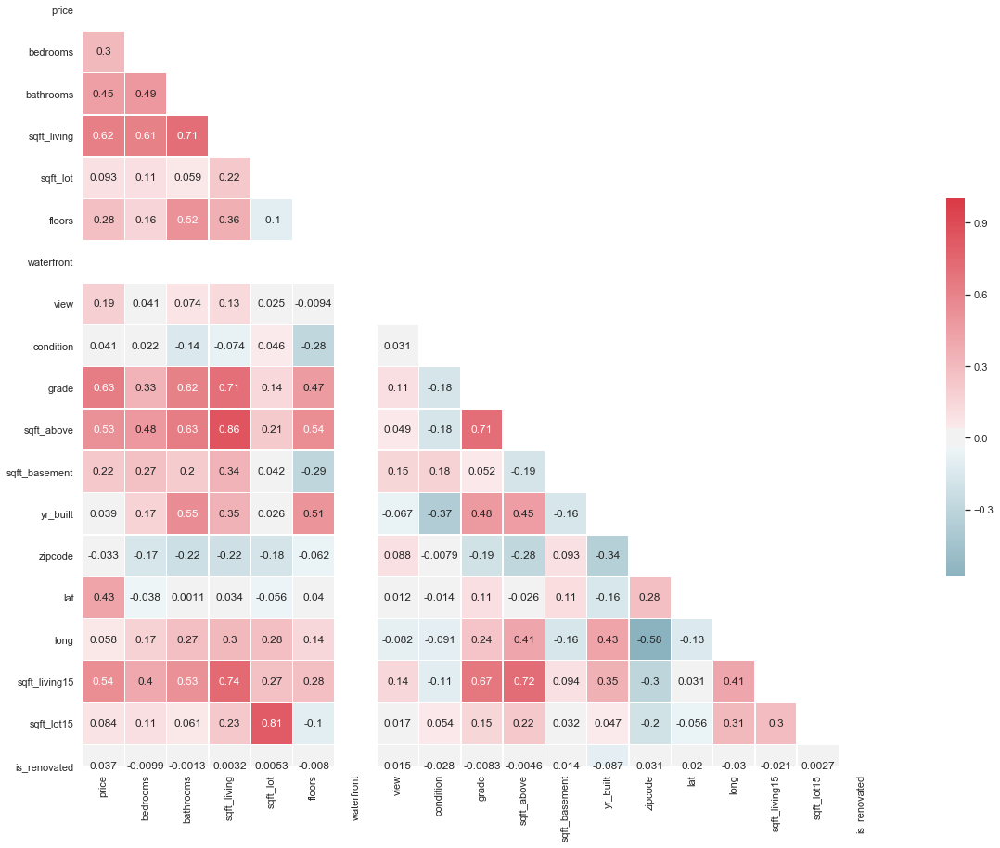


## No results appeared for "Waterfront" and "Is_Renovated" - Drop them


```python
df_clean.drop(['waterfront'],axis=1,inplace=True)
```

    /Users/acusiobivona/opt/anaconda3/envs/learn-env/lib/python3.6/site-packages/pandas/core/frame.py:4102: SettingWithCopyWarning: 
    A value is trying to be set on a copy of a slice from a DataFrame
    
    See the caveats in the documentation: http://pandas.pydata.org/pandas-docs/stable/user_guide/indexing.html#returning-a-view-versus-a-copy
      errors=errors,


```python
df_clean.drop(['is_renovated'],axis=1,inplace=True)
```

## Confirm dropping of columns


```python
df_clean.info()
```

    <class 'pandas.core.frame.DataFrame'>
    Int64Index: 19425 entries, 0 to 21596
    Data columns (total 17 columns):
    price            19425 non-null float64
    bedrooms         19425 non-null int64
    bathrooms        19425 non-null float64
    sqft_living      19425 non-null int64
    sqft_lot         19425 non-null int64
    floors           19425 non-null float64
    view             19425 non-null float64
    condition        19425 non-null int64
    grade            19425 non-null int64
    sqft_above       19425 non-null int64
    sqft_basement    19425 non-null float64
    yr_built         19425 non-null int64
    zipcode          19425 non-null int64
    lat              19425 non-null float64
    long             19425 non-null float64
    sqft_living15    19425 non-null int64
    sqft_lot15       19425 non-null int64
    dtypes: float64(7), int64(10)
    memory usage: 2.7 MB


## Drop "Sqft_Above" and "Sqft_Lot15" to fix multicollinearity issues


```python
df_clean.drop(['sqft_above'],axis=1,inplace=True)
```


```python
df_clean.drop(['sqft_lot15'],axis=1,inplace=True)
```


```python
df_clean.info()
```

    <class 'pandas.core.frame.DataFrame'>
    Int64Index: 19425 entries, 0 to 21596
    Data columns (total 15 columns):
    price            19425 non-null float64
    bedrooms         19425 non-null int64
    bathrooms        19425 non-null float64
    sqft_living      19425 non-null int64
    sqft_lot         19425 non-null int64
    floors           19425 non-null float64
    view             19425 non-null float64
    condition        19425 non-null int64
    grade            19425 non-null int64
    sqft_basement    19425 non-null float64
    yr_built         19425 non-null int64
    zipcode          19425 non-null int64
    lat              19425 non-null float64
    long             19425 non-null float64
    sqft_living15    19425 non-null int64
    dtypes: float64(7), int64(8)
    memory usage: 2.4 MB


# Feature Selection: Grade, Sqft_Living, Sqft_Living15

## Create scatter plot to check for linearity


```python
df_clean.plot("grade","price", kind='scatter')
```

    'c' argument looks like a single numeric RGB or RGBA sequence, which should be avoided as value-mapping will have precedence in case its length matches with 'x' & 'y'.  Please use a 2-D array with a single row if you really want to specify the same RGB or RGBA value for all points.


    <matplotlib.axes._subplots.AxesSubplot at 0x1a1dca1b38>


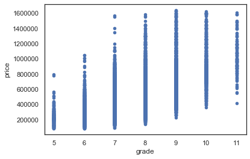


```python
df_clean.plot("sqft_living","price", kind='scatter')
```

    'c' argument looks like a single numeric RGB or RGBA sequence, which should be avoided as value-mapping will have precedence in case its length matches with 'x' & 'y'.  Please use a 2-D array with a single row if you really want to specify the same RGB or RGBA value for all points.


    <matplotlib.axes._subplots.AxesSubplot at 0x1a1cfaadd8>


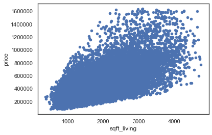


```python
df_clean.plot("sqft_living15","price", kind='scatter')
```

    'c' argument looks like a single numeric RGB or RGBA sequence, which should be avoided as value-mapping will have precedence in case its length matches with 'x' & 'y'.  Please use a 2-D array with a single row if you really want to specify the same RGB or RGBA value for all points.


    <matplotlib.axes._subplots.AxesSubplot at 0x1a1d8155c0>


## Create qq plots for target variables and obtain diagnostic stats


```python
#Initial qq plots
import pandas as pd
import matplotlib.pyplot as plt
%matplotlib inline
import statsmodels.api as sm
import statsmodels.stats.api as sms
import statsmodels.formula.api as smf
import scipy.stats as stats
plt.style.use('ggplot')

f = 'price~grade'
f2 = 'price~sqft_living'
f3 = 'price~sqft_living15'

model = smf.ols(formula=f, data=df_clean).fit()
model2 = smf.ols(formula=f2, data=df_clean).fit()
model3 = smf.ols(formula=f3, data=df_clean).fit()

resid1 = model.resid
resid2 = model2.resid
resid3 = model3.resid

display(model.summary())

fig = sm.graphics.qqplot(resid1, dist=stats.norm, line='45', fit=True)
plt.show()
display(model2.summary())
fig2 = sm.graphics.qqplot(resid2, dist=stats.norm, line='45', fit=True)
plt.show()
fig3 = sm.graphics.qqplot(resid3, dist=stats.norm, line='45', fit=True)
display(model3.summary())
plt.show()
```


<table class="simpletable">
<caption>OLS Regression Results</caption>
<tr>
  <th>Dep. Variable:</th>          <td>price</td>      <th>  R-squared:         </th>  <td>   0.401</td>  
</tr>
<tr>
  <th>Model:</th>                   <td>OLS</td>       <th>  Adj. R-squared:    </th>  <td>   0.401</td>  
</tr>
<tr>
  <th>Method:</th>             <td>Least Squares</td>  <th>  F-statistic:       </th>  <td>1.299e+04</td> 
</tr>
<tr>
  <th>Date:</th>             <td>Wed, 11 Dec 2019</td> <th>  Prob (F-statistic):</th>   <td>  0.00</td>   
</tr>
<tr>
  <th>Time:</th>                 <td>22:17:15</td>     <th>  Log-Likelihood:    </th> <td>-2.6285e+05</td>
</tr>
<tr>
  <th>No. Observations:</th>      <td> 19425</td>      <th>  AIC:               </th>  <td>5.257e+05</td> 
</tr>
<tr>
  <th>Df Residuals:</th>          <td> 19423</td>      <th>  BIC:               </th>  <td>5.257e+05</td> 
</tr>
<tr>
  <th>Df Model:</th>              <td>     1</td>      <th>                     </th>      <td> </td>     
</tr>
<tr>
  <th>Covariance Type:</th>      <td>nonrobust</td>    <th>                     </th>      <td> </td>     
</tr>
</table>
<table class="simpletable">
<tr>
      <td></td>         <th>coef</th>     <th>std err</th>      <th>t</th>      <th>P>|t|</th>  <th>[0.025</th>    <th>0.975]</th>  
</tr>
<tr>
  <th>Intercept</th> <td>-6.112e+05</td> <td> 9710.200</td> <td>  -62.942</td> <td> 0.000</td> <td> -6.3e+05</td> <td>-5.92e+05</td>
</tr>
<tr>
  <th>grade</th>     <td> 1.456e+05</td> <td> 1277.091</td> <td>  113.972</td> <td> 0.000</td> <td> 1.43e+05</td> <td> 1.48e+05</td>
</tr>
</table>
<table class="simpletable">
<tr>
  <th>Omnibus:</th>       <td>3932.649</td> <th>  Durbin-Watson:     </th> <td>   1.941</td>
</tr>
<tr>
  <th>Prob(Omnibus):</th>  <td> 0.000</td>  <th>  Jarque-Bera (JB):  </th> <td>9557.717</td>
</tr>
<tr>
  <th>Skew:</th>           <td> 1.128</td>  <th>  Prob(JB):          </th> <td>    0.00</td>
</tr>
<tr>
  <th>Kurtosis:</th>       <td> 5.592</td>  <th>  Cond. No.          </th> <td>    57.4</td>
</tr>
</table><br/><br/>Warnings:<br/>[1] Standard Errors assume that the covariance matrix of the errors is correctly specified.


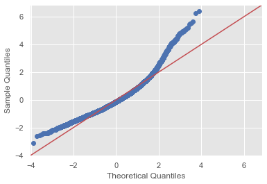


<table class="simpletable">
<caption>OLS Regression Results</caption>
<tr>
  <th>Dep. Variable:</th>          <td>price</td>      <th>  R-squared:         </th>  <td>   0.387</td>  
</tr>
<tr>
  <th>Model:</th>                   <td>OLS</td>       <th>  Adj. R-squared:    </th>  <td>   0.386</td>  
</tr>
<tr>
  <th>Method:</th>             <td>Least Squares</td>  <th>  F-statistic:       </th>  <td>1.224e+04</td> 
</tr>
<tr>
  <th>Date:</th>             <td>Wed, 11 Dec 2019</td> <th>  Prob (F-statistic):</th>   <td>  0.00</td>   
</tr>
<tr>
  <th>Time:</th>                 <td>22:17:15</td>     <th>  Log-Likelihood:    </th> <td>-2.6308e+05</td>
</tr>
<tr>
  <th>No. Observations:</th>      <td> 19425</td>      <th>  AIC:               </th>  <td>5.262e+05</td> 
</tr>
<tr>
  <th>Df Residuals:</th>          <td> 19423</td>      <th>  BIC:               </th>  <td>5.262e+05</td> 
</tr>
<tr>
  <th>Df Model:</th>              <td>     1</td>      <th>                     </th>      <td> </td>     
</tr>
<tr>
  <th>Covariance Type:</th>      <td>nonrobust</td>    <th>                     </th>      <td> </td>     
</tr>
</table>
<table class="simpletable">
<tr>
       <td></td>          <th>coef</th>     <th>std err</th>      <th>t</th>      <th>P>|t|</th>  <th>[0.025</th>    <th>0.975]</th>  
</tr>
<tr>
  <th>Intercept</th>   <td> 9.887e+04</td> <td> 3736.433</td> <td>   26.461</td> <td> 0.000</td> <td> 9.15e+04</td> <td> 1.06e+05</td>
</tr>
<tr>
  <th>sqft_living</th> <td>  197.8770</td> <td>    1.789</td> <td>  110.620</td> <td> 0.000</td> <td>  194.371</td> <td>  201.383</td>
</tr>
</table>
<table class="simpletable">
<tr>
  <th>Omnibus:</th>       <td>3403.470</td> <th>  Durbin-Watson:     </th> <td>   1.965</td>
</tr>
<tr>
  <th>Prob(Omnibus):</th>  <td> 0.000</td>  <th>  Jarque-Bera (JB):  </th> <td>7601.632</td>
</tr>
<tr>
  <th>Skew:</th>           <td> 1.017</td>  <th>  Prob(JB):          </th> <td>    0.00</td>
</tr>
<tr>
  <th>Kurtosis:</th>       <td> 5.293</td>  <th>  Cond. No.          </th> <td>5.90e+03</td>
</tr>
</table><br/><br/>Warnings:<br/>[1] Standard Errors assume that the covariance matrix of the errors is correctly specified.<br/>[2] The condition number is large, 5.9e+03. This might indicate that there are<br/>strong multicollinearity or other numerical problems.


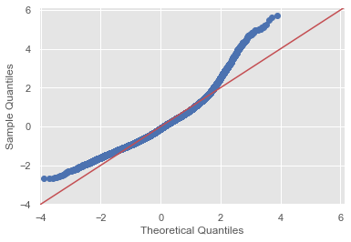


<table class="simpletable">
<caption>OLS Regression Results</caption>
<tr>
  <th>Dep. Variable:</th>          <td>price</td>      <th>  R-squared:         </th>  <td>   0.293</td>  
</tr>
<tr>
  <th>Model:</th>                   <td>OLS</td>       <th>  Adj. R-squared:    </th>  <td>   0.293</td>  
</tr>
<tr>
  <th>Method:</th>             <td>Least Squares</td>  <th>  F-statistic:       </th>  <td>   8061.</td>  
</tr>
<tr>
  <th>Date:</th>             <td>Wed, 11 Dec 2019</td> <th>  Prob (F-statistic):</th>   <td>  0.00</td>   
</tr>
<tr>
  <th>Time:</th>                 <td>22:17:16</td>     <th>  Log-Likelihood:    </th> <td>-2.6446e+05</td>
</tr>
<tr>
  <th>No. Observations:</th>      <td> 19425</td>      <th>  AIC:               </th>  <td>5.289e+05</td> 
</tr>
<tr>
  <th>Df Residuals:</th>          <td> 19423</td>      <th>  BIC:               </th>  <td>5.289e+05</td> 
</tr>
<tr>
  <th>Df Model:</th>              <td>     1</td>      <th>                     </th>      <td> </td>     
</tr>
<tr>
  <th>Covariance Type:</th>      <td>nonrobust</td>    <th>                     </th>      <td> </td>     
</tr>
</table>
<table class="simpletable">
<tr>
        <td></td>           <th>coef</th>     <th>std err</th>      <th>t</th>      <th>P>|t|</th>  <th>[0.025</th>    <th>0.975]</th>  
</tr>
<tr>
  <th>Intercept</th>     <td> 7.851e+04</td> <td> 4749.509</td> <td>   16.529</td> <td> 0.000</td> <td> 6.92e+04</td> <td> 8.78e+04</td>
</tr>
<tr>
  <th>sqft_living15</th> <td>  213.4987</td> <td>    2.378</td> <td>   89.781</td> <td> 0.000</td> <td>  208.838</td> <td>  218.160</td>
</tr>
</table>
<table class="simpletable">
<tr>
  <th>Omnibus:</th>       <td>4839.008</td> <th>  Durbin-Watson:     </th> <td>   1.968</td> 
</tr>
<tr>
  <th>Prob(Omnibus):</th>  <td> 0.000</td>  <th>  Jarque-Bera (JB):  </th> <td>13740.464</td>
</tr>
<tr>
  <th>Skew:</th>           <td> 1.312</td>  <th>  Prob(JB):          </th> <td>    0.00</td> 
</tr>
<tr>
  <th>Kurtosis:</th>       <td> 6.177</td>  <th>  Cond. No.          </th> <td>6.68e+03</td> 
</tr>
</table><br/><br/>Warnings:<br/>[1] Standard Errors assume that the covariance matrix of the errors is correctly specified.<br/>[2] The condition number is large, 6.68e+03. This might indicate that there are<br/>strong multicollinearity or other numerical problems.


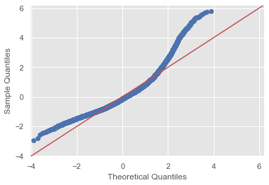


# Create and Run Initial Model


```python
from statsmodels.formula.api import ols
```


```python
f = 'price~grade+sqft_living+sqft_living15'
```


```python
model = ols(formula=f, data=df_clean).fit()
model.summary()
```


<table class="simpletable">
<caption>OLS Regression Results</caption>
<tr>
  <th>Dep. Variable:</th>          <td>price</td>      <th>  R-squared:         </th>  <td>   0.463</td>  
</tr>
<tr>
  <th>Model:</th>                   <td>OLS</td>       <th>  Adj. R-squared:    </th>  <td>   0.463</td>  
</tr>
<tr>
  <th>Method:</th>             <td>Least Squares</td>  <th>  F-statistic:       </th>  <td>   5581.</td>  
</tr>
<tr>
  <th>Date:</th>             <td>Wed, 11 Dec 2019</td> <th>  Prob (F-statistic):</th>   <td>  0.00</td>   
</tr>
<tr>
  <th>Time:</th>                 <td>22:17:16</td>     <th>  Log-Likelihood:    </th> <td>-2.6179e+05</td>
</tr>
<tr>
  <th>No. Observations:</th>      <td> 19425</td>      <th>  AIC:               </th>  <td>5.236e+05</td> 
</tr>
<tr>
  <th>Df Residuals:</th>          <td> 19421</td>      <th>  BIC:               </th>  <td>5.236e+05</td> 
</tr>
<tr>
  <th>Df Model:</th>              <td>     3</td>      <th>                     </th>      <td> </td>     
</tr>
<tr>
  <th>Covariance Type:</th>      <td>nonrobust</td>    <th>                     </th>      <td> </td>     
</tr>
</table>
<table class="simpletable">
<tr>
        <td></td>           <th>coef</th>     <th>std err</th>      <th>t</th>      <th>P>|t|</th>  <th>[0.025</th>    <th>0.975]</th>  
</tr>
<tr>
  <th>Intercept</th>     <td>-3.958e+05</td> <td> 1.03e+04</td> <td>  -38.601</td> <td> 0.000</td> <td>-4.16e+05</td> <td>-3.76e+05</td>
</tr>
<tr>
  <th>grade</th>         <td>  8.48e+04</td> <td> 1798.275</td> <td>   47.154</td> <td> 0.000</td> <td> 8.13e+04</td> <td> 8.83e+04</td>
</tr>
<tr>
  <th>sqft_living</th>   <td>  100.5309</td> <td>    2.739</td> <td>   36.697</td> <td> 0.000</td> <td>   95.161</td> <td>  105.900</td>
</tr>
<tr>
  <th>sqft_living15</th> <td>   24.1182</td> <td>    3.234</td> <td>    7.457</td> <td> 0.000</td> <td>   17.779</td> <td>   30.457</td>
</tr>
</table>
<table class="simpletable">
<tr>
  <th>Omnibus:</th>       <td>3595.518</td> <th>  Durbin-Watson:     </th> <td>   1.953</td>
</tr>
<tr>
  <th>Prob(Omnibus):</th>  <td> 0.000</td>  <th>  Jarque-Bera (JB):  </th> <td>8496.750</td>
</tr>
<tr>
  <th>Skew:</th>           <td> 1.047</td>  <th>  Prob(JB):          </th> <td>    0.00</td>
</tr>
<tr>
  <th>Kurtosis:</th>       <td> 5.472</td>  <th>  Cond. No.          </th> <td>2.41e+04</td>
</tr>
</table><br/><br/>Warnings:<br/>[1] Standard Errors assume that the covariance matrix of the errors is correctly specified.<br/>[2] The condition number is large, 2.41e+04. This might indicate that there are<br/>strong multicollinearity or other numerical problems.


## Initial Results

### Based on the r2 score, only 46.3% of our results can be explained from the data. This is very low. Another model will have to be run, potentially with more/transformed variables in order to get a more trustworthy result.

### Our y-intercept and our coefficent for grade are also very high, meaning that some logging and/or more data transformations should be completed in order to create higher quality variables to insert into the model that can be easier to interpet.

# Re-Explore & Clean Data

## Create histograms for variables and log/scale as needed

However, we DON'T want to log transfrom "Price" because it is our y variable


```python
x = df_clean['price']
ax = sns.distplot(x)
```


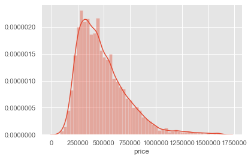


```python
from sklearn.preprocessing import StandardScaler
scaler = StandardScaler()
col_data = df_clean['bedrooms'].values.reshape(-1,1)
scale_data = scaler.fit_transform(col_data)
df_clean['bedrooms_sca'] = scale_data.flatten()

x = df_clean['bedrooms_sca']
ax = sns.distplot(x)
```

    /Users/acusiobivona/opt/anaconda3/envs/learn-env/lib/python3.6/site-packages/ipykernel_launcher.py:5: SettingWithCopyWarning: 
    A value is trying to be set on a copy of a slice from a DataFrame.
    Try using .loc[row_indexer,col_indexer] = value instead
    
    See the caveats in the documentation: http://pandas.pydata.org/pandas-docs/stable/user_guide/indexing.html#returning-a-view-versus-a-copy
      """


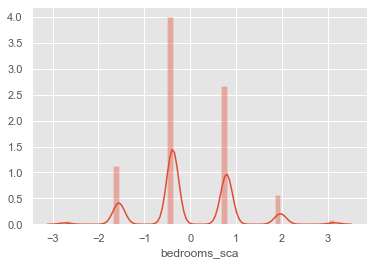


```python
scaler = StandardScaler()
col_data = df_clean['bathrooms'].values.reshape(-1,1)
scale_data = scaler.fit_transform(col_data)
df_clean['bathrooms_sca'] = scale_data.flatten()

x = df_clean['bathrooms_sca']
ax = sns.distplot(x)
```

    /Users/acusiobivona/opt/anaconda3/envs/learn-env/lib/python3.6/site-packages/ipykernel_launcher.py:4: SettingWithCopyWarning: 
    A value is trying to be set on a copy of a slice from a DataFrame.
    Try using .loc[row_indexer,col_indexer] = value instead
    
    See the caveats in the documentation: http://pandas.pydata.org/pandas-docs/stable/user_guide/indexing.html#returning-a-view-versus-a-copy
      after removing the cwd from sys.path.


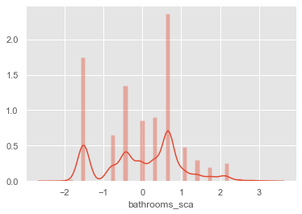


```python
scaler = StandardScaler()
col_data = df_clean['sqft_living'].values.reshape(-1,1)
scale_data = scaler.fit_transform(col_data)
df_clean['sqft_living_sca'] = scale_data.flatten()

x = df_clean['sqft_living_sca']
ax = sns.distplot(x)
```

    /Users/acusiobivona/opt/anaconda3/envs/learn-env/lib/python3.6/site-packages/ipykernel_launcher.py:4: SettingWithCopyWarning: 
    A value is trying to be set on a copy of a slice from a DataFrame.
    Try using .loc[row_indexer,col_indexer] = value instead
    
    See the caveats in the documentation: http://pandas.pydata.org/pandas-docs/stable/user_guide/indexing.html#returning-a-view-versus-a-copy
      after removing the cwd from sys.path.


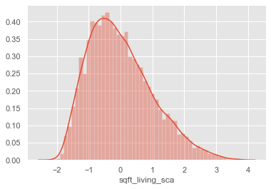


```python
df_clean['sqft_lot'] = np.log(df_clean['sqft_lot'])

scaler = StandardScaler()
col_data = df_clean['sqft_lot'].values.reshape(-1,1)
scale_data = scaler.fit_transform(col_data)
df_clean['sqft_lot_sca'] = scale_data.flatten()

x = df_clean['sqft_lot_sca']
ax = sns.distplot(x)
```

    /Users/acusiobivona/opt/anaconda3/envs/learn-env/lib/python3.6/site-packages/ipykernel_launcher.py:1: SettingWithCopyWarning: 
    A value is trying to be set on a copy of a slice from a DataFrame.
    Try using .loc[row_indexer,col_indexer] = value instead
    
    See the caveats in the documentation: http://pandas.pydata.org/pandas-docs/stable/user_guide/indexing.html#returning-a-view-versus-a-copy
      """Entry point for launching an IPython kernel.
    /Users/acusiobivona/opt/anaconda3/envs/learn-env/lib/python3.6/site-packages/ipykernel_launcher.py:6: SettingWithCopyWarning: 
    A value is trying to be set on a copy of a slice from a DataFrame.
    Try using .loc[row_indexer,col_indexer] = value instead
    
    See the caveats in the documentation: http://pandas.pydata.org/pandas-docs/stable/user_guide/indexing.html#returning-a-view-versus-a-copy
      


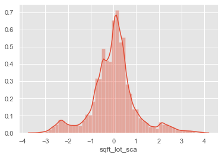


```python
scaler = StandardScaler()
col_data = df_clean['floors'].values.reshape(-1,1)
scale_data = scaler.fit_transform(col_data)
df_clean['floors_sca'] = scale_data.flatten()

x = df_clean['floors_sca']
ax = sns.distplot(x)
```

    /Users/acusiobivona/opt/anaconda3/envs/learn-env/lib/python3.6/site-packages/ipykernel_launcher.py:4: SettingWithCopyWarning: 
    A value is trying to be set on a copy of a slice from a DataFrame.
    Try using .loc[row_indexer,col_indexer] = value instead
    
    See the caveats in the documentation: http://pandas.pydata.org/pandas-docs/stable/user_guide/indexing.html#returning-a-view-versus-a-copy
      after removing the cwd from sys.path.


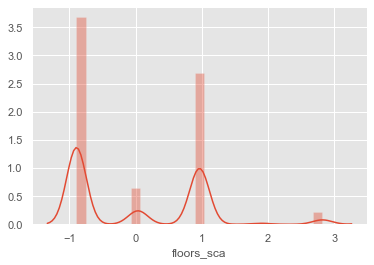


```python
scaler = StandardScaler()
col_data = df_clean['view'].values.reshape(-1,1)
scale_data = scaler.fit_transform(col_data)
df_clean['view_sca'] = scale_data.flatten()

x = df_clean['view_sca']
ax = sns.distplot(x)
```

    /Users/acusiobivona/opt/anaconda3/envs/learn-env/lib/python3.6/site-packages/ipykernel_launcher.py:4: SettingWithCopyWarning: 
    A value is trying to be set on a copy of a slice from a DataFrame.
    Try using .loc[row_indexer,col_indexer] = value instead
    
    See the caveats in the documentation: http://pandas.pydata.org/pandas-docs/stable/user_guide/indexing.html#returning-a-view-versus-a-copy
      after removing the cwd from sys.path.


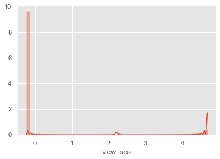


```python
scaler = StandardScaler()
col_data = df_clean['condition'].values.reshape(-1,1)
scale_data = scaler.fit_transform(col_data)
df_clean['condition_sca'] = scale_data.flatten()

x = df_clean['condition_sca']
ax = sns.distplot(x)
```

    /Users/acusiobivona/opt/anaconda3/envs/learn-env/lib/python3.6/site-packages/ipykernel_launcher.py:4: SettingWithCopyWarning: 
    A value is trying to be set on a copy of a slice from a DataFrame.
    Try using .loc[row_indexer,col_indexer] = value instead
    
    See the caveats in the documentation: http://pandas.pydata.org/pandas-docs/stable/user_guide/indexing.html#returning-a-view-versus-a-copy
      after removing the cwd from sys.path.


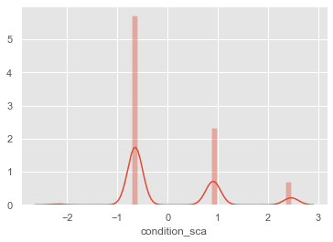


```python
scaler = StandardScaler()
col_data = df_clean['grade'].values.reshape(-1,1)
scale_data = scaler.fit_transform(col_data)
df_clean['grade_sca'] = scale_data.flatten()

x = df_clean['grade_sca']
ax = sns.distplot(x)
```

    /Users/acusiobivona/opt/anaconda3/envs/learn-env/lib/python3.6/site-packages/ipykernel_launcher.py:4: SettingWithCopyWarning: 
    A value is trying to be set on a copy of a slice from a DataFrame.
    Try using .loc[row_indexer,col_indexer] = value instead
    
    See the caveats in the documentation: http://pandas.pydata.org/pandas-docs/stable/user_guide/indexing.html#returning-a-view-versus-a-copy
      after removing the cwd from sys.path.


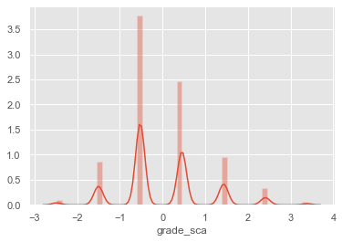


```python
scaler = StandardScaler()
col_data = df_clean['sqft_basement'].values.reshape(-1,1)
scale_data = scaler.fit_transform(col_data)
df_clean['sqft_basement_sca'] = scale_data.flatten()

x = df_clean['sqft_basement_sca']
ax = sns.distplot(x)
```

    /Users/acusiobivona/opt/anaconda3/envs/learn-env/lib/python3.6/site-packages/ipykernel_launcher.py:4: SettingWithCopyWarning: 
    A value is trying to be set on a copy of a slice from a DataFrame.
    Try using .loc[row_indexer,col_indexer] = value instead
    
    See the caveats in the documentation: http://pandas.pydata.org/pandas-docs/stable/user_guide/indexing.html#returning-a-view-versus-a-copy
      after removing the cwd from sys.path.


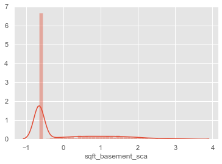


```python
scaler = StandardScaler()
col_data = df_clean['yr_built'].values.reshape(-1,1)
scale_data = scaler.fit_transform(col_data)
df_clean['yr_built_sca'] = scale_data.flatten()

x = df_clean['yr_built_sca']
ax = sns.distplot(x)
```

    /Users/acusiobivona/opt/anaconda3/envs/learn-env/lib/python3.6/site-packages/ipykernel_launcher.py:4: SettingWithCopyWarning: 
    A value is trying to be set on a copy of a slice from a DataFrame.
    Try using .loc[row_indexer,col_indexer] = value instead
    
    See the caveats in the documentation: http://pandas.pydata.org/pandas-docs/stable/user_guide/indexing.html#returning-a-view-versus-a-copy
      after removing the cwd from sys.path.


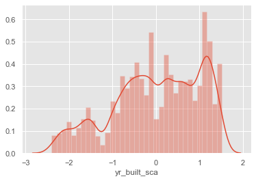


```python
scaler = StandardScaler()
col_data = df_clean['lat'].values.reshape(-1,1)
scale_data = scaler.fit_transform(col_data)
df_clean['lat_sca'] = scale_data.flatten()

x = df_clean['lat_sca']
ax = sns.distplot(x)
```

    /Users/acusiobivona/opt/anaconda3/envs/learn-env/lib/python3.6/site-packages/ipykernel_launcher.py:4: SettingWithCopyWarning: 
    A value is trying to be set on a copy of a slice from a DataFrame.
    Try using .loc[row_indexer,col_indexer] = value instead
    
    See the caveats in the documentation: http://pandas.pydata.org/pandas-docs/stable/user_guide/indexing.html#returning-a-view-versus-a-copy
      after removing the cwd from sys.path.


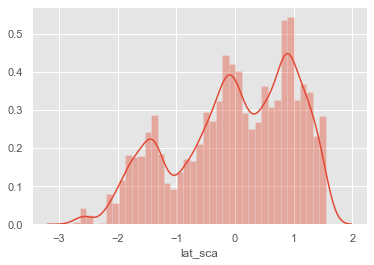


```python
scaler = StandardScaler()
col_data = df_clean['long'].values.reshape(-1,1)
scale_data = scaler.fit_transform(col_data)
df_clean['long_sca'] = scale_data.flatten()

x = df_clean['long_sca']
ax = sns.distplot(x)
```

    /Users/acusiobivona/opt/anaconda3/envs/learn-env/lib/python3.6/site-packages/ipykernel_launcher.py:4: SettingWithCopyWarning: 
    A value is trying to be set on a copy of a slice from a DataFrame.
    Try using .loc[row_indexer,col_indexer] = value instead
    
    See the caveats in the documentation: http://pandas.pydata.org/pandas-docs/stable/user_guide/indexing.html#returning-a-view-versus-a-copy
      after removing the cwd from sys.path.


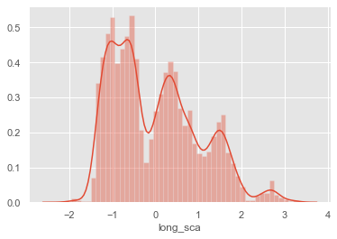


```python
scaler = StandardScaler()
col_data = df_clean['sqft_living15'].values.reshape(-1,1)
scale_data = scaler.fit_transform(col_data)
df_clean['sqft_living15_sca'] = scale_data.flatten()

x = df_clean['sqft_living15_sca']
ax = sns.distplot(x)
```

    /Users/acusiobivona/opt/anaconda3/envs/learn-env/lib/python3.6/site-packages/ipykernel_launcher.py:4: SettingWithCopyWarning: 
    A value is trying to be set on a copy of a slice from a DataFrame.
    Try using .loc[row_indexer,col_indexer] = value instead
    
    See the caveats in the documentation: http://pandas.pydata.org/pandas-docs/stable/user_guide/indexing.html#returning-a-view-versus-a-copy
      after removing the cwd from sys.path.


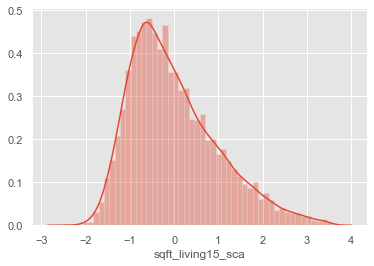


## Create new heatmap that includes scaled variables - check again for multicollinearity


```python
sns.set(style="white")
#Correlations are low - good thing?


# Compute the correlation matrix
corr = df_clean.corr()

# Generate a mask for the upper triangle
mask = np.zeros_like(corr, dtype=np.bool)
mask[np.triu_indices_from(mask)] = True

# Set up the matplotlib figure
f, ax = plt.subplots(figsize=(55, 22))

# Generate a custom diverging colormap
cmap = sns.diverging_palette(220, 10, as_cmap=True)

# Draw the heatmap with the mask and correct aspect ratio
sns.heatmap(corr, mask=mask, cmap=cmap, center=0,
            square=True, linewidths=.5, cbar_kws={"shrink": .5}, annot=True)
```


    <matplotlib.axes._subplots.AxesSubplot at 0x1c20b13e10>


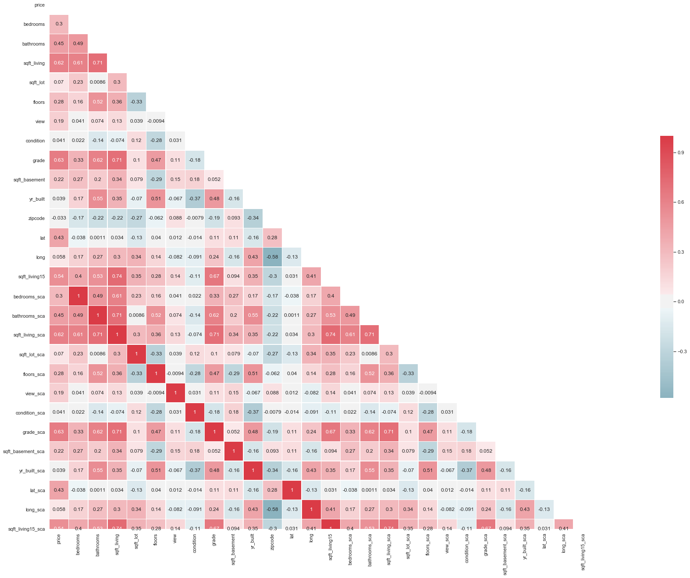


## Multicollineraity is only present with the original (non-scaled) variables and their respective, new (scaled) variables. Drop original variables


```python
df_clean.drop(['bedrooms'],axis=1,inplace=True)
```

    /Users/acusiobivona/opt/anaconda3/envs/learn-env/lib/python3.6/site-packages/pandas/core/frame.py:4102: SettingWithCopyWarning: 
    A value is trying to be set on a copy of a slice from a DataFrame
    
    See the caveats in the documentation: http://pandas.pydata.org/pandas-docs/stable/user_guide/indexing.html#returning-a-view-versus-a-copy
      errors=errors,


```python
df_clean.drop(['bathrooms'],axis=1,inplace=True)
```


```python
df_clean.drop(['sqft_living'],axis=1,inplace=True)
```


```python
df_clean.drop(['sqft_lot'],axis=1,inplace=True)
```


```python
df_clean.drop(['floors'],axis=1,inplace=True)
```


```python
df_clean.drop(['view'],axis=1,inplace=True)
```


```python
df_clean.drop(['condition'],axis=1,inplace=True)
```


```python
df_clean.drop(['grade'],axis=1,inplace=True)
```


```python
df_clean.drop(['sqft_basement'],axis=1,inplace=True)
```


```python
df_clean.drop(['yr_built'],axis=1,inplace=True)
```


```python
df_clean.drop(['lat'],axis=1,inplace=True)
```


```python
df_clean.drop(['long'],axis=1,inplace=True)
```


```python
df_clean.drop(['sqft_living15'],axis=1,inplace=True)
```

## Check and confirm original columns were dropped


```python
df_clean.info()
```

    <class 'pandas.core.frame.DataFrame'>
    Int64Index: 19425 entries, 0 to 21596
    Data columns (total 15 columns):
    price                19425 non-null float64
    zipcode              19425 non-null int64
    bedrooms_sca         19425 non-null float64
    bathrooms_sca        19425 non-null float64
    sqft_living_sca      19425 non-null float64
    sqft_lot_sca         19425 non-null float64
    floors_sca           19425 non-null float64
    view_sca             19425 non-null float64
    condition_sca        19425 non-null float64
    grade_sca            19425 non-null float64
    sqft_basement_sca    19425 non-null float64
    yr_built_sca         19425 non-null float64
    lat_sca              19425 non-null float64
    long_sca             19425 non-null float64
    sqft_living15_sca    19425 non-null float64
    dtypes: float64(14), int64(1)
    memory usage: 2.4 MB


## Create another heatmap in order to confirm no multicolinnearity with scaled variables


```python
sns.set(style="white")
#Correlations are low - good thing?


# Compute the correlation matrix
corr = df_clean.corr()

# Generate a mask for the upper triangle
mask = np.zeros_like(corr, dtype=np.bool)
mask[np.triu_indices_from(mask)] = True

# Set up the matplotlib figure
f, ax = plt.subplots(figsize=(25, 10))

# Generate a custom diverging colormap
cmap = sns.diverging_palette(220, 10, as_cmap=True)

# Draw the heatmap with the mask and correct aspect ratio
sns.heatmap(corr, mask=mask, cmap=cmap, center=0,
            square=True, linewidths=.5, cbar_kws={"shrink": .5}, annot=True)
```


    <matplotlib.axes._subplots.AxesSubplot at 0x1c20160048>


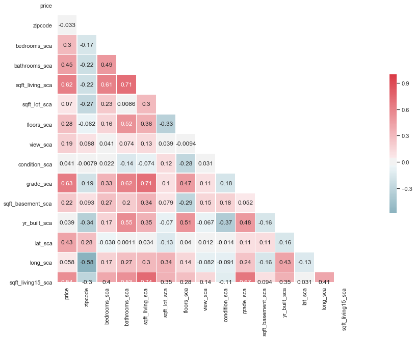


## Recreate scatter plots to check for linearity with new (scaled) variables


```python
df_clean.plot("grade_sca","price", kind='scatter')
```

    'c' argument looks like a single numeric RGB or RGBA sequence, which should be avoided as value-mapping will have precedence in case its length matches with 'x' & 'y'.  Please use a 2-D array with a single row if you really want to specify the same RGB or RGBA value for all points.


    <matplotlib.axes._subplots.AxesSubplot at 0x1c20250ef0>


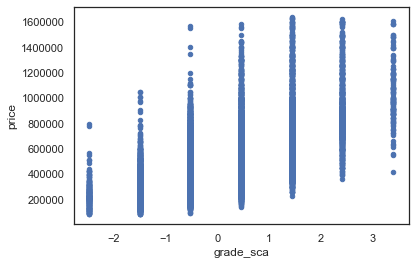


```python
df_clean.plot("sqft_living_sca","price", kind='scatter')
```

    'c' argument looks like a single numeric RGB or RGBA sequence, which should be avoided as value-mapping will have precedence in case its length matches with 'x' & 'y'.  Please use a 2-D array with a single row if you really want to specify the same RGB or RGBA value for all points.


    <matplotlib.axes._subplots.AxesSubplot at 0x1c1f85df28>


```python
df_clean.plot("sqft_living15_sca","price", kind='scatter')
```

    'c' argument looks like a single numeric RGB or RGBA sequence, which should be avoided as value-mapping will have precedence in case its length matches with 'x' & 'y'.  Please use a 2-D array with a single row if you really want to specify the same RGB or RGBA value for all points.


    <matplotlib.axes._subplots.AxesSubplot at 0x1c206f7b70>


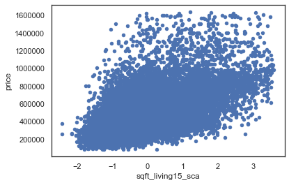


## Create updated qq plots


```python
import pandas as pd
import matplotlib.pyplot as plt
%matplotlib inline
import statsmodels.api as sm
import statsmodels.stats.api as sms
import statsmodels.formula.api as smf
import scipy.stats as stats
plt.style.use('ggplot')

f = 'price~grade_sca'
f2 = 'price~sqft_living_sca'
f3 = 'price~sqft_living15_sca'

model = smf.ols(formula=f, data=df_clean).fit()
model2 = smf.ols(formula=f2, data=df_clean).fit()
model3 = smf.ols(formula=f3, data=df_clean).fit()

resid1 = model.resid
resid2 = model2.resid
resid3 = model3.resid

display(model.summary())

fig = sm.graphics.qqplot(resid1, dist=stats.norm, line='45', fit=True)
plt.show()
display(model2.summary())
fig2 = sm.graphics.qqplot(resid2, dist=stats.norm, line='45', fit=True)
plt.show()
fig3 = sm.graphics.qqplot(resid3, dist=stats.norm, line='45', fit=True)
display(model3.summary())
plt.show()
```


<table class="simpletable">
<caption>OLS Regression Results</caption>
<tr>
  <th>Dep. Variable:</th>          <td>price</td>      <th>  R-squared:         </th>  <td>   0.401</td>  
</tr>
<tr>
  <th>Model:</th>                   <td>OLS</td>       <th>  Adj. R-squared:    </th>  <td>   0.401</td>  
</tr>
<tr>
  <th>Method:</th>             <td>Least Squares</td>  <th>  F-statistic:       </th>  <td>1.299e+04</td> 
</tr>
<tr>
  <th>Date:</th>             <td>Wed, 11 Dec 2019</td> <th>  Prob (F-statistic):</th>   <td>  0.00</td>   
</tr>
<tr>
  <th>Time:</th>                 <td>22:17:24</td>     <th>  Log-Likelihood:    </th> <td>-2.6285e+05</td>
</tr>
<tr>
  <th>No. Observations:</th>      <td> 19425</td>      <th>  AIC:               </th>  <td>5.257e+05</td> 
</tr>
<tr>
  <th>Df Residuals:</th>          <td> 19423</td>      <th>  BIC:               </th>  <td>5.257e+05</td> 
</tr>
<tr>
  <th>Df Model:</th>              <td>     1</td>      <th>                     </th>      <td> </td>     
</tr>
<tr>
  <th>Covariance Type:</th>      <td>nonrobust</td>    <th>                     </th>      <td> </td>     
</tr>
</table>
<table class="simpletable">
<tr>
      <td></td>         <th>coef</th>     <th>std err</th>      <th>t</th>      <th>P>|t|</th>  <th>[0.025</th>    <th>0.975]</th>  
</tr>
<tr>
  <th>Intercept</th> <td> 4.854e+05</td> <td> 1307.259</td> <td>  371.333</td> <td> 0.000</td> <td> 4.83e+05</td> <td> 4.88e+05</td>
</tr>
<tr>
  <th>grade_sca</th> <td>  1.49e+05</td> <td> 1307.259</td> <td>  113.972</td> <td> 0.000</td> <td> 1.46e+05</td> <td> 1.52e+05</td>
</tr>
</table>
<table class="simpletable">
<tr>
  <th>Omnibus:</th>       <td>3932.649</td> <th>  Durbin-Watson:     </th> <td>   1.941</td>
</tr>
<tr>
  <th>Prob(Omnibus):</th>  <td> 0.000</td>  <th>  Jarque-Bera (JB):  </th> <td>9557.717</td>
</tr>
<tr>
  <th>Skew:</th>           <td> 1.128</td>  <th>  Prob(JB):          </th> <td>    0.00</td>
</tr>
<tr>
  <th>Kurtosis:</th>       <td> 5.592</td>  <th>  Cond. No.          </th> <td>    1.00</td>
</tr>
</table><br/><br/>Warnings:<br/>[1] Standard Errors assume that the covariance matrix of the errors is correctly specified.


<table class="simpletable">
<caption>OLS Regression Results</caption>
<tr>
  <th>Dep. Variable:</th>          <td>price</td>      <th>  R-squared:         </th>  <td>   0.387</td>  
</tr>
<tr>
  <th>Model:</th>                   <td>OLS</td>       <th>  Adj. R-squared:    </th>  <td>   0.386</td>  
</tr>
<tr>
  <th>Method:</th>             <td>Least Squares</td>  <th>  F-statistic:       </th>  <td>1.224e+04</td> 
</tr>
<tr>
  <th>Date:</th>             <td>Wed, 11 Dec 2019</td> <th>  Prob (F-statistic):</th>   <td>  0.00</td>   
</tr>
<tr>
  <th>Time:</th>                 <td>22:17:24</td>     <th>  Log-Likelihood:    </th> <td>-2.6308e+05</td>
</tr>
<tr>
  <th>No. Observations:</th>      <td> 19425</td>      <th>  AIC:               </th>  <td>5.262e+05</td> 
</tr>
<tr>
  <th>Df Residuals:</th>          <td> 19423</td>      <th>  BIC:               </th>  <td>5.262e+05</td> 
</tr>
<tr>
  <th>Df Model:</th>              <td>     1</td>      <th>                     </th>      <td> </td>     
</tr>
<tr>
  <th>Covariance Type:</th>      <td>nonrobust</td>    <th>                     </th>      <td> </td>     
</tr>
</table>
<table class="simpletable">
<tr>
         <td></td>            <th>coef</th>     <th>std err</th>      <th>t</th>      <th>P>|t|</th>  <th>[0.025</th>    <th>0.975]</th>  
</tr>
<tr>
  <th>Intercept</th>       <td> 4.854e+05</td> <td> 1322.710</td> <td>  366.996</td> <td> 0.000</td> <td> 4.83e+05</td> <td> 4.88e+05</td>
</tr>
<tr>
  <th>sqft_living_sca</th> <td> 1.463e+05</td> <td> 1322.710</td> <td>  110.620</td> <td> 0.000</td> <td> 1.44e+05</td> <td> 1.49e+05</td>
</tr>
</table>
<table class="simpletable">
<tr>
  <th>Omnibus:</th>       <td>3403.470</td> <th>  Durbin-Watson:     </th> <td>   1.965</td>
</tr>
<tr>
  <th>Prob(Omnibus):</th>  <td> 0.000</td>  <th>  Jarque-Bera (JB):  </th> <td>7601.632</td>
</tr>
<tr>
  <th>Skew:</th>           <td> 1.017</td>  <th>  Prob(JB):          </th> <td>    0.00</td>
</tr>
<tr>
  <th>Kurtosis:</th>       <td> 5.293</td>  <th>  Cond. No.          </th> <td>    1.00</td>
</tr>
</table><br/><br/>Warnings:<br/>[1] Standard Errors assume that the covariance matrix of the errors is correctly specified.


<table class="simpletable">
<caption>OLS Regression Results</caption>
<tr>
  <th>Dep. Variable:</th>          <td>price</td>      <th>  R-squared:         </th>  <td>   0.293</td>  
</tr>
<tr>
  <th>Model:</th>                   <td>OLS</td>       <th>  Adj. R-squared:    </th>  <td>   0.293</td>  
</tr>
<tr>
  <th>Method:</th>             <td>Least Squares</td>  <th>  F-statistic:       </th>  <td>   8061.</td>  
</tr>
<tr>
  <th>Date:</th>             <td>Wed, 11 Dec 2019</td> <th>  Prob (F-statistic):</th>   <td>  0.00</td>   
</tr>
<tr>
  <th>Time:</th>                 <td>22:17:25</td>     <th>  Log-Likelihood:    </th> <td>-2.6446e+05</td>
</tr>
<tr>
  <th>No. Observations:</th>      <td> 19425</td>      <th>  AIC:               </th>  <td>5.289e+05</td> 
</tr>
<tr>
  <th>Df Residuals:</th>          <td> 19423</td>      <th>  BIC:               </th>  <td>5.289e+05</td> 
</tr>
<tr>
  <th>Df Model:</th>              <td>     1</td>      <th>                     </th>      <td> </td>     
</tr>
<tr>
  <th>Covariance Type:</th>      <td>nonrobust</td>    <th>                     </th>      <td> </td>     
</tr>
</table>
<table class="simpletable">
<tr>
          <td></td>             <th>coef</th>     <th>std err</th>      <th>t</th>      <th>P>|t|</th>  <th>[0.025</th>    <th>0.975]</th>  
</tr>
<tr>
  <th>Intercept</th>         <td> 4.854e+05</td> <td> 1419.647</td> <td>  341.936</td> <td> 0.000</td> <td> 4.83e+05</td> <td> 4.88e+05</td>
</tr>
<tr>
  <th>sqft_living15_sca</th> <td> 1.275e+05</td> <td> 1419.647</td> <td>   89.781</td> <td> 0.000</td> <td> 1.25e+05</td> <td>  1.3e+05</td>
</tr>
</table>
<table class="simpletable">
<tr>
  <th>Omnibus:</th>       <td>4839.008</td> <th>  Durbin-Watson:     </th> <td>   1.968</td> 
</tr>
<tr>
  <th>Prob(Omnibus):</th>  <td> 0.000</td>  <th>  Jarque-Bera (JB):  </th> <td>13740.464</td>
</tr>
<tr>
  <th>Skew:</th>           <td> 1.312</td>  <th>  Prob(JB):          </th> <td>    0.00</td> 
</tr>
<tr>
  <th>Kurtosis:</th>       <td> 6.177</td>  <th>  Cond. No.          </th> <td>    1.00</td> 
</tr>
</table><br/><br/>Warnings:<br/>[1] Standard Errors assume that the covariance matrix of the errors is correctly specified.


# Create Updated Model - Including Zipcodes

Although zipcodes have numbers, they have no numerical significance in our data. Thus, this variable is treated as categorical. The code below represents this, and explains why no dummies or label encoding occurred for zipcode previously.


```python
f = 'price~grade_sca+sqft_living_sca+sqft_living15_sca+C(zipcode)'
```


```python
model = ols(formula=f, data=df_clean).fit()
model.summary()
```


<table class="simpletable">
<caption>OLS Regression Results</caption>
<tr>
  <th>Dep. Variable:</th>          <td>price</td>      <th>  R-squared:         </th>  <td>   0.811</td>  
</tr>
<tr>
  <th>Model:</th>                   <td>OLS</td>       <th>  Adj. R-squared:    </th>  <td>   0.811</td>  
</tr>
<tr>
  <th>Method:</th>             <td>Least Squares</td>  <th>  F-statistic:       </th>  <td>   1155.</td>  
</tr>
<tr>
  <th>Date:</th>             <td>Wed, 11 Dec 2019</td> <th>  Prob (F-statistic):</th>   <td>  0.00</td>   
</tr>
<tr>
  <th>Time:</th>                 <td>22:17:25</td>     <th>  Log-Likelihood:    </th> <td>-2.5163e+05</td>
</tr>
<tr>
  <th>No. Observations:</th>      <td> 19425</td>      <th>  AIC:               </th>  <td>5.034e+05</td> 
</tr>
<tr>
  <th>Df Residuals:</th>          <td> 19352</td>      <th>  BIC:               </th>  <td>5.040e+05</td> 
</tr>
<tr>
  <th>Df Model:</th>              <td>    72</td>      <th>                     </th>      <td> </td>     
</tr>
<tr>
  <th>Covariance Type:</th>      <td>nonrobust</td>    <th>                     </th>      <td> </td>     
</tr>
</table>
<table class="simpletable">
<tr>
           <td></td>              <th>coef</th>     <th>std err</th>      <th>t</th>      <th>P>|t|</th>  <th>[0.025</th>    <th>0.975]</th>  
</tr>
<tr>
  <th>Intercept</th>           <td> 3.008e+05</td> <td> 5464.615</td> <td>   55.043</td> <td> 0.000</td> <td>  2.9e+05</td> <td> 3.11e+05</td>
</tr>
<tr>
  <th>C(zipcode)[T.98002]</th> <td>  2.77e+04</td> <td> 9149.338</td> <td>    3.027</td> <td> 0.002</td> <td> 9763.047</td> <td> 4.56e+04</td>
</tr>
<tr>
  <th>C(zipcode)[T.98003]</th> <td>  568.6620</td> <td> 8290.855</td> <td>    0.069</td> <td> 0.945</td> <td>-1.57e+04</td> <td> 1.68e+04</td>
</tr>
<tr>
  <th>C(zipcode)[T.98004]</th> <td> 6.177e+05</td> <td> 8863.153</td> <td>   69.693</td> <td> 0.000</td> <td>    6e+05</td> <td> 6.35e+05</td>
</tr>
<tr>
  <th>C(zipcode)[T.98005]</th> <td> 3.409e+05</td> <td> 1.01e+04</td> <td>   33.647</td> <td> 0.000</td> <td> 3.21e+05</td> <td> 3.61e+05</td>
</tr>
<tr>
  <th>C(zipcode)[T.98006]</th> <td> 2.735e+05</td> <td> 7653.416</td> <td>   35.740</td> <td> 0.000</td> <td> 2.59e+05</td> <td> 2.89e+05</td>
</tr>
<tr>
  <th>C(zipcode)[T.98007]</th> <td> 2.588e+05</td> <td> 1.04e+04</td> <td>   24.921</td> <td> 0.000</td> <td> 2.38e+05</td> <td> 2.79e+05</td>
</tr>
<tr>
  <th>C(zipcode)[T.98008]</th> <td> 2.488e+05</td> <td> 8407.206</td> <td>   29.592</td> <td> 0.000</td> <td> 2.32e+05</td> <td> 2.65e+05</td>
</tr>
<tr>
  <th>C(zipcode)[T.98010]</th> <td> 9.684e+04</td> <td> 1.28e+04</td> <td>    7.592</td> <td> 0.000</td> <td> 7.18e+04</td> <td> 1.22e+05</td>
</tr>
<tr>
  <th>C(zipcode)[T.98011]</th> <td> 1.324e+05</td> <td> 9271.932</td> <td>   14.282</td> <td> 0.000</td> <td> 1.14e+05</td> <td> 1.51e+05</td>
</tr>
<tr>
  <th>C(zipcode)[T.98014]</th> <td> 1.306e+05</td> <td> 1.34e+04</td> <td>    9.742</td> <td> 0.000</td> <td> 1.04e+05</td> <td> 1.57e+05</td>
</tr>
<tr>
  <th>C(zipcode)[T.98019]</th> <td> 7.969e+04</td> <td> 9715.982</td> <td>    8.201</td> <td> 0.000</td> <td> 6.06e+04</td> <td> 9.87e+04</td>
</tr>
<tr>
  <th>C(zipcode)[T.98022]</th> <td> 3.206e+04</td> <td> 9590.051</td> <td>    3.343</td> <td> 0.001</td> <td> 1.33e+04</td> <td> 5.09e+04</td>
</tr>
<tr>
  <th>C(zipcode)[T.98023]</th> <td>-2.385e+04</td> <td> 7186.070</td> <td>   -3.320</td> <td> 0.001</td> <td>-3.79e+04</td> <td>-9768.925</td>
</tr>
<tr>
  <th>C(zipcode)[T.98024]</th> <td> 1.591e+05</td> <td> 1.59e+04</td> <td>    9.998</td> <td> 0.000</td> <td> 1.28e+05</td> <td>  1.9e+05</td>
</tr>
<tr>
  <th>C(zipcode)[T.98027]</th> <td> 1.893e+05</td> <td> 7747.684</td> <td>   24.437</td> <td> 0.000</td> <td> 1.74e+05</td> <td> 2.05e+05</td>
</tr>
<tr>
  <th>C(zipcode)[T.98028]</th> <td> 1.264e+05</td> <td> 8286.519</td> <td>   15.255</td> <td> 0.000</td> <td>  1.1e+05</td> <td> 1.43e+05</td>
</tr>
<tr>
  <th>C(zipcode)[T.98029]</th> <td> 2.127e+05</td> <td> 8029.902</td> <td>   26.491</td> <td> 0.000</td> <td> 1.97e+05</td> <td> 2.28e+05</td>
</tr>
<tr>
  <th>C(zipcode)[T.98030]</th> <td>-2062.6877</td> <td> 8463.849</td> <td>   -0.244</td> <td> 0.807</td> <td>-1.87e+04</td> <td> 1.45e+04</td>
</tr>
<tr>
  <th>C(zipcode)[T.98031]</th> <td> 9841.6594</td> <td> 8305.785</td> <td>    1.185</td> <td> 0.236</td> <td>-6438.399</td> <td> 2.61e+04</td>
</tr>
<tr>
  <th>C(zipcode)[T.98032]</th> <td> 4437.7011</td> <td> 1.08e+04</td> <td>    0.412</td> <td> 0.680</td> <td>-1.67e+04</td> <td> 2.55e+04</td>
</tr>
<tr>
  <th>C(zipcode)[T.98033]</th> <td> 3.584e+05</td> <td> 7538.181</td> <td>   47.542</td> <td> 0.000</td> <td> 3.44e+05</td> <td> 3.73e+05</td>
</tr>
<tr>
  <th>C(zipcode)[T.98034]</th> <td> 1.854e+05</td> <td> 7090.871</td> <td>   26.149</td> <td> 0.000</td> <td> 1.72e+05</td> <td> 1.99e+05</td>
</tr>
<tr>
  <th>C(zipcode)[T.98038]</th> <td> 2.177e+04</td> <td> 7034.060</td> <td>    3.096</td> <td> 0.002</td> <td> 7987.355</td> <td> 3.56e+04</td>
</tr>
<tr>
  <th>C(zipcode)[T.98039]</th> <td> 8.336e+05</td> <td> 2.55e+04</td> <td>   32.730</td> <td> 0.000</td> <td> 7.84e+05</td> <td> 8.84e+05</td>
</tr>
<tr>
  <th>C(zipcode)[T.98040]</th> <td> 4.967e+05</td> <td> 9115.153</td> <td>   54.496</td> <td> 0.000</td> <td> 4.79e+05</td> <td> 5.15e+05</td>
</tr>
<tr>
  <th>C(zipcode)[T.98042]</th> <td> 7178.3196</td> <td> 7061.869</td> <td>    1.016</td> <td> 0.309</td> <td>-6663.555</td> <td>  2.1e+04</td>
</tr>
<tr>
  <th>C(zipcode)[T.98045]</th> <td> 8.749e+04</td> <td> 3.29e+04</td> <td>    2.663</td> <td> 0.008</td> <td> 2.31e+04</td> <td> 1.52e+05</td>
</tr>
<tr>
  <th>C(zipcode)[T.98052]</th> <td> 2.449e+05</td> <td> 7026.388</td> <td>   34.848</td> <td> 0.000</td> <td> 2.31e+05</td> <td> 2.59e+05</td>
</tr>
<tr>
  <th>C(zipcode)[T.98053]</th> <td> 2.261e+05</td> <td> 7849.334</td> <td>   28.799</td> <td> 0.000</td> <td> 2.11e+05</td> <td> 2.41e+05</td>
</tr>
<tr>
  <th>C(zipcode)[T.98055]</th> <td> 4.506e+04</td> <td> 8387.268</td> <td>    5.372</td> <td> 0.000</td> <td> 2.86e+04</td> <td> 6.15e+04</td>
</tr>
<tr>
  <th>C(zipcode)[T.98056]</th> <td> 1.089e+05</td> <td> 7513.969</td> <td>   14.497</td> <td> 0.000</td> <td> 9.42e+04</td> <td> 1.24e+05</td>
</tr>
<tr>
  <th>C(zipcode)[T.98058]</th> <td> 3.247e+04</td> <td> 7351.502</td> <td>    4.417</td> <td> 0.000</td> <td> 1.81e+04</td> <td> 4.69e+04</td>
</tr>
<tr>
  <th>C(zipcode)[T.98059]</th> <td> 9.377e+04</td> <td> 7388.412</td> <td>   12.691</td> <td> 0.000</td> <td> 7.93e+04</td> <td> 1.08e+05</td>
</tr>
<tr>
  <th>C(zipcode)[T.98065]</th> <td> 1.095e+05</td> <td> 8368.790</td> <td>   13.081</td> <td> 0.000</td> <td> 9.31e+04</td> <td> 1.26e+05</td>
</tr>
<tr>
  <th>C(zipcode)[T.98070]</th> <td> 1.577e+05</td> <td> 1.59e+04</td> <td>    9.909</td> <td> 0.000</td> <td> 1.26e+05</td> <td> 1.89e+05</td>
</tr>
<tr>
  <th>C(zipcode)[T.98072]</th> <td> 1.755e+05</td> <td> 8456.459</td> <td>   20.754</td> <td> 0.000</td> <td> 1.59e+05</td> <td> 1.92e+05</td>
</tr>
<tr>
  <th>C(zipcode)[T.98074]</th> <td> 1.994e+05</td> <td> 7580.668</td> <td>   26.300</td> <td> 0.000</td> <td> 1.85e+05</td> <td> 2.14e+05</td>
</tr>
<tr>
  <th>C(zipcode)[T.98075]</th> <td> 2.152e+05</td> <td> 8173.843</td> <td>   26.325</td> <td> 0.000</td> <td> 1.99e+05</td> <td> 2.31e+05</td>
</tr>
<tr>
  <th>C(zipcode)[T.98077]</th> <td> 1.667e+05</td> <td> 9821.559</td> <td>   16.968</td> <td> 0.000</td> <td> 1.47e+05</td> <td> 1.86e+05</td>
</tr>
<tr>
  <th>C(zipcode)[T.98092]</th> <td>-2.776e+04</td> <td> 8042.968</td> <td>   -3.452</td> <td> 0.001</td> <td>-4.35e+04</td> <td> -1.2e+04</td>
</tr>
<tr>
  <th>C(zipcode)[T.98102]</th> <td> 4.488e+05</td> <td> 1.19e+04</td> <td>   37.779</td> <td> 0.000</td> <td> 4.26e+05</td> <td> 4.72e+05</td>
</tr>
<tr>
  <th>C(zipcode)[T.98103]</th> <td> 3.379e+05</td> <td> 6955.801</td> <td>   48.584</td> <td> 0.000</td> <td> 3.24e+05</td> <td> 3.52e+05</td>
</tr>
<tr>
  <th>C(zipcode)[T.98105]</th> <td> 4.457e+05</td> <td> 9078.161</td> <td>   49.101</td> <td> 0.000</td> <td> 4.28e+05</td> <td> 4.64e+05</td>
</tr>
<tr>
  <th>C(zipcode)[T.98106]</th> <td> 1.257e+05</td> <td> 7893.714</td> <td>   15.924</td> <td> 0.000</td> <td>  1.1e+05</td> <td> 1.41e+05</td>
</tr>
<tr>
  <th>C(zipcode)[T.98107]</th> <td> 3.285e+05</td> <td> 8446.555</td> <td>   38.889</td> <td> 0.000</td> <td> 3.12e+05</td> <td> 3.45e+05</td>
</tr>
<tr>
  <th>C(zipcode)[T.98108]</th> <td> 1.208e+05</td> <td> 9344.234</td> <td>   12.933</td> <td> 0.000</td> <td> 1.03e+05</td> <td> 1.39e+05</td>
</tr>
<tr>
  <th>C(zipcode)[T.98109]</th> <td> 4.844e+05</td> <td> 1.17e+04</td> <td>   41.500</td> <td> 0.000</td> <td> 4.61e+05</td> <td> 5.07e+05</td>
</tr>
<tr>
  <th>C(zipcode)[T.98112]</th> <td> 5.303e+05</td> <td> 8823.197</td> <td>   60.100</td> <td> 0.000</td> <td> 5.13e+05</td> <td> 5.48e+05</td>
</tr>
<tr>
  <th>C(zipcode)[T.98115]</th> <td> 3.399e+05</td> <td> 6960.777</td> <td>   48.833</td> <td> 0.000</td> <td> 3.26e+05</td> <td> 3.54e+05</td>
</tr>
<tr>
  <th>C(zipcode)[T.98116]</th> <td> 3.081e+05</td> <td> 8142.751</td> <td>   37.842</td> <td> 0.000</td> <td> 2.92e+05</td> <td> 3.24e+05</td>
</tr>
<tr>
  <th>C(zipcode)[T.98117]</th> <td> 3.289e+05</td> <td> 7055.596</td> <td>   46.619</td> <td> 0.000</td> <td> 3.15e+05</td> <td> 3.43e+05</td>
</tr>
<tr>
  <th>C(zipcode)[T.98118]</th> <td> 1.741e+05</td> <td> 7215.845</td> <td>   24.126</td> <td> 0.000</td> <td>  1.6e+05</td> <td> 1.88e+05</td>
</tr>
<tr>
  <th>C(zipcode)[T.98119]</th> <td> 4.477e+05</td> <td> 9712.037</td> <td>   46.092</td> <td> 0.000</td> <td> 4.29e+05</td> <td> 4.67e+05</td>
</tr>
<tr>
  <th>C(zipcode)[T.98122]</th> <td> 3.323e+05</td> <td> 8293.237</td> <td>   40.071</td> <td> 0.000</td> <td> 3.16e+05</td> <td> 3.49e+05</td>
</tr>
<tr>
  <th>C(zipcode)[T.98125]</th> <td> 2.026e+05</td> <td> 7566.216</td> <td>   26.782</td> <td> 0.000</td> <td> 1.88e+05</td> <td> 2.17e+05</td>
</tr>
<tr>
  <th>C(zipcode)[T.98126]</th> <td> 2.132e+05</td> <td> 7832.445</td> <td>   27.221</td> <td> 0.000</td> <td> 1.98e+05</td> <td> 2.29e+05</td>
</tr>
<tr>
  <th>C(zipcode)[T.98133]</th> <td> 1.599e+05</td> <td> 7174.256</td> <td>   22.289</td> <td> 0.000</td> <td> 1.46e+05</td> <td> 1.74e+05</td>
</tr>
<tr>
  <th>C(zipcode)[T.98136]</th> <td> 2.637e+05</td> <td> 8609.641</td> <td>   30.626</td> <td> 0.000</td> <td> 2.47e+05</td> <td> 2.81e+05</td>
</tr>
<tr>
  <th>C(zipcode)[T.98144]</th> <td> 2.528e+05</td> <td> 8007.464</td> <td>   31.576</td> <td> 0.000</td> <td> 2.37e+05</td> <td> 2.69e+05</td>
</tr>
<tr>
  <th>C(zipcode)[T.98146]</th> <td>  1.14e+05</td> <td> 8397.029</td> <td>   13.570</td> <td> 0.000</td> <td> 9.75e+04</td> <td>  1.3e+05</td>
</tr>
<tr>
  <th>C(zipcode)[T.98148]</th> <td> 5.709e+04</td> <td> 1.49e+04</td> <td>    3.842</td> <td> 0.000</td> <td>  2.8e+04</td> <td> 8.62e+04</td>
</tr>
<tr>
  <th>C(zipcode)[T.98155]</th> <td> 1.495e+05</td> <td> 7390.105</td> <td>   20.223</td> <td> 0.000</td> <td> 1.35e+05</td> <td> 1.64e+05</td>
</tr>
<tr>
  <th>C(zipcode)[T.98166]</th> <td> 1.157e+05</td> <td> 8817.237</td> <td>   13.121</td> <td> 0.000</td> <td> 9.84e+04</td> <td> 1.33e+05</td>
</tr>
<tr>
  <th>C(zipcode)[T.98168]</th> <td> 6.076e+04</td> <td> 8348.681</td> <td>    7.278</td> <td> 0.000</td> <td> 4.44e+04</td> <td> 7.71e+04</td>
</tr>
<tr>
  <th>C(zipcode)[T.98177]</th> <td>  2.21e+05</td> <td> 8912.677</td> <td>   24.801</td> <td> 0.000</td> <td> 2.04e+05</td> <td> 2.39e+05</td>
</tr>
<tr>
  <th>C(zipcode)[T.98178]</th> <td> 6.119e+04</td> <td> 8597.968</td> <td>    7.117</td> <td> 0.000</td> <td> 4.43e+04</td> <td>  7.8e+04</td>
</tr>
<tr>
  <th>C(zipcode)[T.98188]</th> <td>  3.99e+04</td> <td> 1.05e+04</td> <td>    3.794</td> <td> 0.000</td> <td> 1.93e+04</td> <td> 6.05e+04</td>
</tr>
<tr>
  <th>C(zipcode)[T.98198]</th> <td> 3.702e+04</td> <td> 8528.283</td> <td>    4.341</td> <td> 0.000</td> <td> 2.03e+04</td> <td> 5.37e+04</td>
</tr>
<tr>
  <th>C(zipcode)[T.98199]</th> <td> 3.822e+05</td> <td> 8233.260</td> <td>   46.422</td> <td> 0.000</td> <td> 3.66e+05</td> <td> 3.98e+05</td>
</tr>
<tr>
  <th>grade_sca</th>           <td> 4.457e+04</td> <td> 1154.013</td> <td>   38.619</td> <td> 0.000</td> <td> 4.23e+04</td> <td> 4.68e+04</td>
</tr>
<tr>
  <th>sqft_living_sca</th>     <td> 9.052e+04</td> <td> 1215.971</td> <td>   74.445</td> <td> 0.000</td> <td> 8.81e+04</td> <td> 9.29e+04</td>
</tr>
<tr>
  <th>sqft_living15_sca</th>   <td> 2.263e+04</td> <td> 1256.334</td> <td>   18.015</td> <td> 0.000</td> <td> 2.02e+04</td> <td> 2.51e+04</td>
</tr>
</table>
<table class="simpletable">
<tr>
  <th>Omnibus:</th>       <td>4717.987</td> <th>  Durbin-Watson:     </th> <td>   1.972</td> 
</tr>
<tr>
  <th>Prob(Omnibus):</th>  <td> 0.000</td>  <th>  Jarque-Bera (JB):  </th> <td>26062.034</td>
</tr>
<tr>
  <th>Skew:</th>           <td> 1.057</td>  <th>  Prob(JB):          </th> <td>    0.00</td> 
</tr>
<tr>
  <th>Kurtosis:</th>       <td> 8.266</td>  <th>  Cond. No.          </th> <td>    98.7</td> 
</tr>
</table><br/><br/>Warnings:<br/>[1] Standard Errors assume that the covariance matrix of the errors is correctly specified.


## Use model.params to display the coefficents for each variable


```python
model.params
```


    Intercept              300786.725098
    C(zipcode)[T.98002]     27696.540770
    C(zipcode)[T.98003]       568.662033
    C(zipcode)[T.98004]    617698.066830
    C(zipcode)[T.98005]    340872.954218
                               ...      
    C(zipcode)[T.98198]     37021.947882
    C(zipcode)[T.98199]    382206.668531
    grade_sca               44567.125248
    sqft_living_sca         90522.646431
    sqft_living15_sca       22633.470556
    Length: 73, dtype: float64


# Validate Model w/ Train-Test Split


```python
from sklearn.model_selection import train_test_split
X = df_clean.drop('price', axis=1)
y = df_clean['price']
X_train, X_test, y_train, y_test = train_test_split(X, y, test_size=0.20, random_state=42)
```


```python
df_train = pd.DataFrame(X_train, columns = X.columns)
df_train['price'] = y_train
df_test = pd.DataFrame(X_test, columns = X.columns)
df_test['price'] = y_test
```


```python
from sklearn.metrics import r2_score
y_hat_test = model.predict(df_test)
r2_score(y_test, y_hat_test)
```


    0.8138381135737504


# Conclusions & Recommendations

After running the second model, we can confidently say that the variables zipcode, sqft_living, grade, and sqft_living15 are strong influencers on the value of homes in King County. According to this model, 81% of our results can be explained by the data from these variables. Depending on your zipcode, it can be the largest influence on your home value, the smallest, or be somewhere in the middle. In other words, location matters - a lot. The next biggest influencer is sqft_living. If you have plenty of square footage inside of the home, the value of the home will increase. Third, is grade. Having a solid grade by the King County Grading System will provide your home with increased value. And lastly, there is sqft_living15. This one is pretty easy - if your neighbors have lots of square footage inside their homes, the value of your home will increase.

So, to maximize the value of your home, do the following:

1.)Make sure your home is in affluent zipcodes

2.)Make sure the home has lots of interior square footage

3.)Create the home using high-quality materials so that it is graded well by the King County Grading System

4.)Choose land/lots where the nearest 15 neighbors have a large amount of interior square footage.

# Code for tables for presentation


```python
def eda_plot(df_clean, col = 'grade_sca', target='price',
            figsize=(10,5),hist_kws = None, kde_kws = None):
    """Plots a seaborn disrplot and a scatter plot of col vs target.
    
    Args:
        df (DataFrame): data to plot
        col (str): Name of the column to plot
        target (str): Name of the target variable for scatterplot
        figsize (tup): Figsize
        hist_kws (dict): Keywords for seaborn distplot histogram
        kde_kws (dict): Keywords for seaborn distplot kde
        
    Returns:
        fig (Figure Object)
        ax (list of Axes objects)
    """
    # Lets write our plot together

    fig, axes = plt.subplots(ncols=2,figsize=figsize)

    ax = axes[0]
    
    
    if hist_kws is None:
        hist_kws = {'edgecolor':'black',
                   'alpha':0.3}
        
    if kde_kws is None:
        kde_kws = {'color':'black'}
    
    sns.distplot(df_clean[col],ax=ax,kde_kws=kde_kws, hist_kws=hist_kws)

    label_fonts = {'weight':'bold',
                  'size':14}
    title_fonts = {'weight':'bold',
                  'size':20}

    ax.set_title(f'Distribution of {col}',fontdict=title_fonts)


    ax.set_ylabel('Density',fontdict=label_fonts)
    ax.set_xlabel(ax.get_xlabel(),fontdict=label_fonts)

    ax = axes[1]
    df_clean.plot(kind='scatter',x=col,y=target,ax=ax)
    ax.set_title(f"{col.title()} vs {target}",fontdict=title_fonts)
    ax.set_ylabel(ax.get_ylabel(),fontdict=label_fonts)
    ax.set_xlabel(ax.get_xlabel(),fontdict=label_fonts)
    
#     fmtPrice = '${x:,.0f}'

    tick_format = mpl.ticker.StrMethodFormatter('${x:,.2f}')
    ax.yaxis.set_major_formatter(tick_format)
        # Formatting dollar sign labels
#     tickPrice = mtick.StrMethodFormatter(fmtPrice)


    plt.tight_layout()
    plt.show()
    
    return fig, axes
    
f,a = eda_plot(df_clean,col='grade_sca',kde_kws={'color':'red','ls':':'})
```


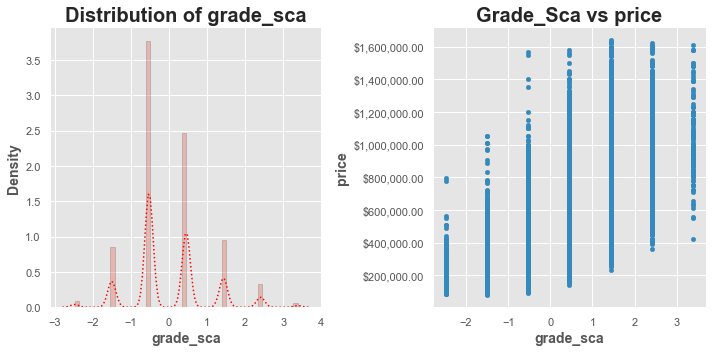


```python
def eda_plot(df_clean, col = 'sqft_living_sca', target='price',
            figsize=(10,5),hist_kws = None, kde_kws = None):
    """Plots a seaborn disrplot and a scatter plot of col vs target.
    
    Args:
        df (DataFrame): data to plot
        col (str): Name of the column to plot
        target (str): Name of the target variable for scatterplot
        figsize (tup): Figsize
        hist_kws (dict): Keywords for seaborn distplot histogram
        kde_kws (dict): Keywords for seaborn distplot kde
        
    Returns:
        fig (Figure Object)
        ax (list of Axes objects)
    """
    # Lets write our plot together

    fig, axes = plt.subplots(ncols=2,figsize=figsize)

    ax = axes[0]
    
    
    if hist_kws is None:
        hist_kws = {'edgecolor':'black',
                   'alpha':0.3}
        
    if kde_kws is None:
        kde_kws = {'color':'black'}
    
    sns.distplot(df_clean[col],ax=ax,kde_kws=kde_kws, hist_kws=hist_kws)

    label_fonts = {'weight':'bold',
                  'size':14}
    title_fonts = {'weight':'bold',
                  'size':20}

    ax.set_title(f'Distribution of {col}',fontdict=title_fonts)


    ax.set_ylabel('Density',fontdict=label_fonts)
    ax.set_xlabel(ax.get_xlabel(),fontdict=label_fonts)

    ax = axes[1]
    df_clean.plot(kind='scatter',x=col,y=target,ax=ax)
    ax.set_title(f"{col.title()} vs {target}",fontdict=title_fonts)
    ax.set_ylabel(ax.get_ylabel(),fontdict=label_fonts)
    ax.set_xlabel(ax.get_xlabel(),fontdict=label_fonts)
    
#     fmtPrice = '${x:,.0f}'

    tick_format = mpl.ticker.StrMethodFormatter('${x:,.2f}')
    ax.yaxis.set_major_formatter(tick_format)
        # Formatting dollar sign labels
#     tickPrice = mtick.StrMethodFormatter(fmtPrice)


    plt.tight_layout()
    plt.show()
    
    return fig, axes
    
f,a = eda_plot(df_clean,col='sqft_living_sca',kde_kws={'color':'red','ls':':'})
```


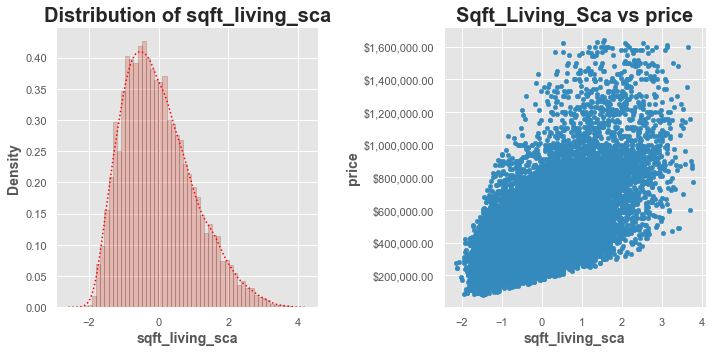


```python
def eda_plot(df_clean, col = 'sqft_living15_sca', target='price',
            figsize=(10,5),hist_kws = None, kde_kws = None):
    """Plots a seaborn disrplot and a scatter plot of col vs target.
    
    Args:
        df (DataFrame): data to plot
        col (str): Name of the column to plot
        target (str): Name of the target variable for scatterplot
        figsize (tup): Figsize
        hist_kws (dict): Keywords for seaborn distplot histogram
        kde_kws (dict): Keywords for seaborn distplot kde
        
    Returns:
        fig (Figure Object)
        ax (list of Axes objects)
    """
    # Lets write our plot together

    fig, axes = plt.subplots(ncols=2,figsize=figsize)

    ax = axes[0]
    
    
    if hist_kws is None:
        hist_kws = {'edgecolor':'black',
                   'alpha':0.3}
        
    if kde_kws is None:
        kde_kws = {'color':'black'}
    
    sns.distplot(df_clean[col],ax=ax,kde_kws=kde_kws, hist_kws=hist_kws)

    label_fonts = {'weight':'bold',
                  'size':14}
    title_fonts = {'weight':'bold',
                  'size':20}

    ax.set_title(f'Distribution of {col}',fontdict=title_fonts)


    ax.set_ylabel('Density',fontdict=label_fonts)
    ax.set_xlabel(ax.get_xlabel(),fontdict=label_fonts)

    ax = axes[1]
    df_clean.plot(kind='scatter',x=col,y=target,ax=ax)
    ax.set_title(f"{col.title()} vs {target}",fontdict=title_fonts)
    ax.set_ylabel(ax.get_ylabel(),fontdict=label_fonts)
    ax.set_xlabel(ax.get_xlabel(),fontdict=label_fonts)
    
#     fmtPrice = '${x:,.0f}'

    tick_format = mpl.ticker.StrMethodFormatter('${x:,.2f}')
    ax.yaxis.set_major_formatter(tick_format)
        # Formatting dollar sign labels
#     tickPrice = mtick.StrMethodFormatter(fmtPrice)


    plt.tight_layout()
    plt.show()
    
    return fig, axes
    
f,a = eda_plot(df_clean,col='sqft_living15_sca',kde_kws={'color':'red','ls':':'})
```


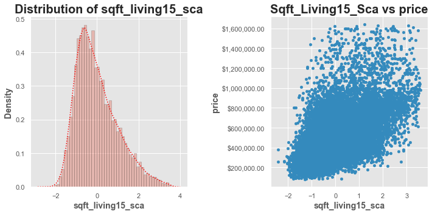

